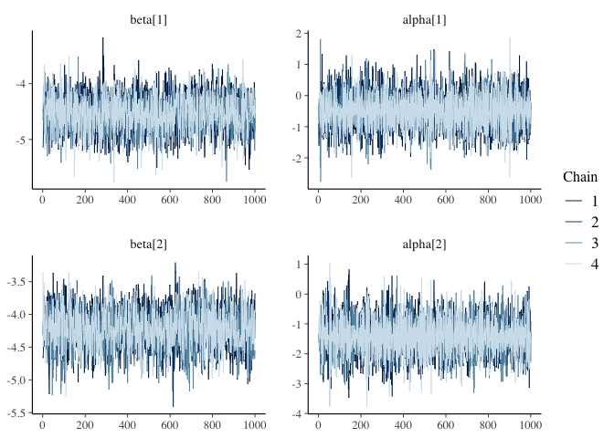
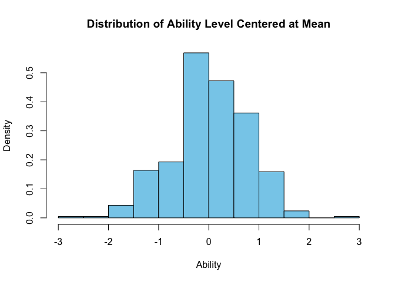
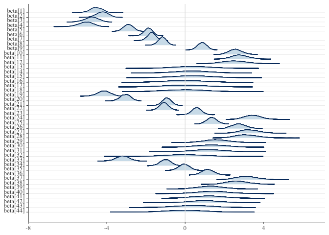

# Homework 8 Project Report
Alyssa Kam

- [Research Question](#research-question)
  - [Can a Bayesian Data Analysis model converge when applied to an IRT
    model of Vocabulary ability, with missing items in different
    versions?](#can-a-bayesian-data-analysis-model-converge-when-applied-to-an-irt-model-of-vocabulary-ability-with-missing-items-in-different-versions)
- [Add relevant packages](#add-relevant-packages)
- [Read in Child data - Wechsler Intelligence Scale for Children
  (WISC)](#read-in-child-data---wechsler-intelligence-scale-for-children-wisc)
- [Remove the X column that has the row
  number](#remove-the-x-column-that-has-the-row-number)
- [Description of each variable](#description-of-each-variable)
- [Only keep 7 year olds](#only-keep-7-year-olds)
- [Keep only 1 twin in the pair](#keep-only-1-twin-in-the-pair)
- [Convert data to long format](#convert-data-to-long-format)
- [Convert the item and ID variable to
  numeric](#convert-the-item-and-id-variable-to-numeric)
- [For the 1pl model, convert to
  binary](#for-the-1pl-model-convert-to-binary)
- [Exclude NA on “response”](#exclude-na-on-response)
- [Call the stan model](#call-the-stan-model)
- [Model and Priors](#model-and-priors)
  - [Model](#model)
  - [Priors](#priors)
- [Make data frame and declare
  variables](#make-data-frame-and-declare-variables)
- [Fit the model with the data](#fit-the-model-with-the-data)
- [Convergence check with first 2 items and first 2
  individuals](#convergence-check-with-first-2-items-and-first-2-individuals)
- [Parameter coefficient summary of delta, beta, and
  alpha](#parameter-coefficient-summary-of-delta-beta-and-alpha)
- [Posterior Distribution of the beta, or difficulty level for each
  item](#posterior-distribution-of-the-beta-or-difficulty-level-for-each-item)
- [Intepretations](#intepretations)

## Research Question

### Can a Bayesian Data Analysis model converge when applied to an IRT model of Vocabulary ability, with missing items in different versions?

## Add relevant packages

``` r
library(dplyr)
library(base)
library(cmdstanr)
library(tidyverse)
library(bayesplot)
library(posterior)
```

## Read in Child data - Wechsler Intelligence Scale for Children (WISC)

``` r
getwd()
```

    [1] "/Users/alyssakam/Documents/PSYC-573/Project"

``` r
wiscall <- read.csv("PSYC-573_LTS.csv", header = TRUE)
```

## Remove the X column that has the row number

``` r
wiscall <- wiscall[,-1]
```

## Description of each variable

``` r
names(wiscall)
```

     [1] "ID"      "FAMID"   "Age"     "Version" "item1"   "item2"   "item3"  
     [8] "item4"   "item5"   "item6"   "item7"   "item8"   "item9"   "item10" 
    [15] "item11"  "item12"  "item13"  "item14"  "item15"  "item16"  "item17" 
    [22] "item18"  "item19"  "item20"  "item21"  "item22"  "item23"  "item24" 
    [29] "item25"  "item26"  "item27"  "item28"  "item29"  "item30"  "item31" 
    [36] "item32"  "item33"  "item34"  "item35"  "item36"  "item37"  "item38" 
    [43] "item39"  "item40"  "item41"  "item42"  "item43"  "item44" 

`ID` = ID variable unique for each twin

`FAMID` = ID variable unique for each pair

`Age` = Age of twin in years, rounded to nearest whole year

`Version` = Wechsler test version; -1 = WISC, 0 = WISC-R, 1 = WISC-III

`item 1-44` = all items, unique and common across test versions

An individual may have a missing value for an item for any of the
following reasons:

1.  The item did not appear on the version of the test the individual
    took

2.  The individual met the discontinue rule (Ex: stop administration if
    get 5 0s in a row)

## Only keep 7 year olds

``` r
wiscall7 <- wiscall[wiscall$Age == 7,]
```

## Keep only 1 twin in the pair

``` r
famid <- unique(wiscall7$FAMID)
wiscall7_single <- data.frame(wiscall7[1,])
wiscall7_single <-wiscall7_single[-1,]
for(j in 1:length(famid)){
  #make a tall data frame of every observation for selected cluster variable
  df <- wiscall7[which(famid[j] == wiscall7$FAMID),]
  df <- arrange(df, FAMID)
  #take the last observation
  last <- tail(df, 1)
  #add it to the empty data frame
  wiscall7_single <- rbind(wiscall7_single, last)
}
```

## Convert data to long format

``` r
wiscall7_single_long <- wiscall7_single |>
  pivot_longer(
    cols = 5:48,
    names_to = "item",
    values_to = "response")
```

## Convert the item and ID variable to numeric

``` r
wiscall7_single_long$item <- as.numeric(as.factor(wiscall7_single_long$item))
wiscall7_single_long$ID <- as.numeric(as.factor(wiscall7_single_long$ID))
```

## For the 1pl model, convert to binary

``` r
wiscall7_single_long$response[wiscall7_single_long$response == 2] <- 1
```

## Exclude NA on “response”

``` r
data_complete <- wiscall7_single_long[complete.cases(wiscall7_single_long$response), ]
```

## Call the stan model

``` r
mod <- cmdstan_model("onepl.stan")
```

## Model and Priors

### Model

\$ Pr\[y\_{n} = 1\] = logit^{-1} (*{jj\[n\]} - *{kk\[n\]} + ) \$

### Priors

\$ *{i} N(0,1)\$ \$ *{i} N(0,1)\$ \$ \_{i} N(0,1)\$

## Make data frame and declare variables

``` r
stan_data <- list(
  J = 415, #sample size
  K = 44, #number of unique items
  N = nrow(data_complete), #of total observations
  jj = data_complete$ID, #each person
  kk = data_complete$item, #each item
  y = data_complete$response #response coded as 0/1
)
```

## Fit the model with the data

``` r
fit <- mod$sample(
  data = stan_data,
  seed = 123,
  chains = 4,
  parallel_chains = 4
)
```

## Convergence check with first 2 items and first 2 individuals

``` r
fit_post_draws <- fit$draws(c("beta[1]", "alpha[1]",
                              "beta[2]", "alpha[2]"))
mcmc_trace(fit_post_draws)
```



## Parameter coefficient summary of delta, beta, and alpha

``` r
fit_summ <- fit$summary(c("delta", "beta", "alpha"))
# Use `knitr::kable()` for tabulation
knitr::kable(fit_summ, digits = 2)
```

| variable     |  mean | median |   sd |  mad |    q5 |   q95 | rhat | ess_bulk | ess_tail |
|:-------------|------:|-------:|-----:|-----:|------:|------:|-----:|---------:|---------:|
| delta        | -0.77 |  -0.77 | 0.18 | 0.18 | -1.08 | -0.46 | 1.00 |   974.13 |  1424.77 |
| beta\[1\]    | -4.55 |  -4.53 | 0.31 | 0.31 | -5.08 | -4.06 | 1.00 |  2633.11 |  2623.96 |
| beta\[2\]    |  2.56 |   2.56 | 0.33 | 0.33 |  2.03 |  3.11 | 1.00 |  2502.54 |  2806.14 |
| beta\[3\]    |  2.78 |   2.77 | 0.42 | 0.41 |  2.09 |  3.49 | 1.00 |  4127.48 |  2848.35 |
| beta\[4\]    |  2.50 |   2.49 | 0.61 | 0.62 |  1.53 |  3.52 | 1.00 |  6900.20 |  2738.09 |
| beta\[5\]    |  0.36 |   0.35 | 0.91 | 0.92 | -1.12 |  1.87 | 1.00 | 10091.09 |  2849.49 |
| beta\[6\]    |  0.39 |   0.37 | 0.91 | 0.91 | -1.09 |  1.90 | 1.00 |  8821.03 |  3008.80 |
| beta\[7\]    |  0.39 |   0.38 | 0.90 | 0.88 | -1.08 |  1.88 | 1.00 |  8949.61 |  2696.32 |
| beta\[8\]    |  0.01 |   0.01 | 0.99 | 0.99 | -1.67 |  1.64 | 1.00 |  9305.65 |  2769.97 |
| beta\[9\]    |  0.00 |   0.00 | 0.99 | 0.95 | -1.65 |  1.59 | 1.00 |  8120.29 |  2882.65 |
| beta\[10\]   |  0.01 |   0.01 | 0.98 | 0.99 | -1.62 |  1.63 | 1.00 | 10249.83 |  2503.11 |
| beta\[11\]   | -4.15 |  -4.14 | 0.32 | 0.32 | -4.69 | -3.63 | 1.00 |  2460.73 |  2836.65 |
| beta\[12\]   | -4.23 |  -4.23 | 0.28 | 0.28 | -4.73 | -3.79 | 1.00 |  1942.00 |  2536.61 |
| beta\[13\]   | -3.05 |  -3.04 | 0.26 | 0.26 | -3.48 | -2.63 | 1.00 |  1542.60 |  2368.14 |
| beta\[14\]   | -0.94 |  -0.94 | 0.22 | 0.22 | -1.31 | -0.58 | 1.00 |  1186.01 |  2195.35 |
| beta\[15\]   | -1.09 |  -1.09 | 0.22 | 0.22 | -1.45 | -0.73 | 1.00 |  1270.92 |  2107.24 |
| beta\[16\]   |  0.59 |   0.59 | 0.23 | 0.23 |  0.22 |  0.97 | 1.00 |  1317.22 |  2391.50 |
| beta\[17\]   |  3.44 |   3.42 | 0.41 | 0.40 |  2.79 |  4.14 | 1.00 |  3544.74 |  2813.53 |
| beta\[18\]   |  1.36 |   1.36 | 0.25 | 0.25 |  0.95 |  1.77 | 1.00 |  1688.42 |  2465.89 |
| beta\[19\]   |  2.74 |   2.74 | 0.36 | 0.36 |  2.16 |  3.33 | 1.00 |  2722.47 |  2471.68 |
| beta\[20\]   |  3.27 |   3.26 | 0.48 | 0.48 |  2.51 |  4.09 | 1.00 |  5104.57 |  2818.27 |
| beta\[21\]   |  3.13 |   3.11 | 0.56 | 0.55 |  2.25 |  4.08 | 1.00 |  5335.49 |  2206.45 |
| beta\[22\]   |  1.58 |   1.56 | 0.63 | 0.61 |  0.57 |  2.68 | 1.00 |  5489.64 |  2445.59 |
| beta\[23\]   | -4.78 |  -4.78 | 0.33 | 0.33 | -5.34 | -4.26 | 1.00 |  2410.62 |  2686.65 |
| beta\[24\]   |  1.35 |   1.34 | 0.78 | 0.77 |  0.08 |  2.64 | 1.00 |  7268.39 |  3051.33 |
| beta\[25\]   |  1.17 |   1.16 | 0.79 | 0.78 | -0.13 |  2.53 | 1.00 |  8429.99 |  2732.86 |
| beta\[26\]   |  0.00 |   0.00 | 0.97 | 0.98 | -1.60 |  1.60 | 1.00 |  7819.21 |  3022.38 |
| beta\[27\]   | -3.20 |  -3.19 | 0.33 | 0.32 | -3.73 | -2.67 | 1.00 |  2586.01 |  2814.39 |
| beta\[28\]   | -1.01 |  -1.02 | 0.26 | 0.26 | -1.44 | -0.59 | 1.00 |  1564.87 |  2485.31 |
| beta\[29\]   | -0.06 |  -0.06 | 0.26 | 0.26 | -0.47 |  0.38 | 1.00 |  1701.20 |  2665.25 |
| beta\[30\]   |  1.14 |   1.14 | 0.30 | 0.29 |  0.66 |  1.64 | 1.00 |  2023.74 |  2592.79 |
| beta\[31\]   |  3.12 |   3.09 | 0.48 | 0.48 |  2.35 |  3.98 | 1.00 |  5026.34 |  2888.58 |
| beta\[32\]   |  2.65 |   2.63 | 0.54 | 0.52 |  1.79 |  3.57 | 1.00 |  5411.08 |  2435.03 |
| beta\[33\]   |  1.28 |   1.27 | 0.68 | 0.67 |  0.20 |  2.42 | 1.00 |  6674.91 |  2296.54 |
| beta\[34\]   | -5.08 |  -5.07 | 0.36 | 0.36 | -5.69 | -4.49 | 1.00 |  2693.43 |  2847.51 |
| beta\[35\]   |  1.41 |   1.39 | 0.75 | 0.75 |  0.21 |  2.67 | 1.00 |  7640.94 |  2924.90 |
| beta\[36\]   |  1.20 |   1.18 | 0.79 | 0.81 | -0.06 |  2.55 | 1.00 |  7668.67 |  2839.31 |
| beta\[37\]   |  1.02 |   1.00 | 0.81 | 0.81 | -0.32 |  2.36 | 1.00 | 10173.95 |  2566.59 |
| beta\[38\]   |  0.44 |   0.44 | 0.93 | 0.93 | -1.09 |  1.97 | 1.00 | 10315.25 |  2729.85 |
| beta\[39\]   |  0.00 |   0.01 | 1.00 | 1.00 | -1.68 |  1.63 | 1.00 | 10538.34 |  2304.73 |
| beta\[40\]   | -2.91 |  -2.90 | 0.23 | 0.23 | -3.28 | -2.52 | 1.00 |  1335.09 |  2358.81 |
| beta\[41\]   | -1.88 |  -1.88 | 0.20 | 0.20 | -2.23 | -1.56 | 1.00 |  1134.52 |  2023.78 |
| beta\[42\]   | -1.71 |  -1.71 | 0.21 | 0.21 | -2.06 | -1.37 | 1.00 |  1123.47 |  1925.68 |
| beta\[43\]   | -1.17 |  -1.16 | 0.21 | 0.21 | -1.52 | -0.83 | 1.00 |  1021.28 |  1681.45 |
| beta\[44\]   |  0.86 |   0.86 | 0.22 | 0.22 |  0.50 |  1.22 | 1.00 |  1232.08 |  2042.09 |
| alpha\[1\]   | -0.49 |  -0.49 | 0.59 | 0.60 | -1.48 |  0.50 | 1.00 |  9214.31 |  2678.56 |
| alpha\[2\]   | -1.42 |  -1.43 | 0.59 | 0.60 | -2.38 | -0.46 | 1.00 |  9352.66 |  2862.93 |
| alpha\[3\]   | -0.12 |  -0.13 | 0.58 | 0.59 | -1.06 |  0.85 | 1.00 |  9105.93 |  2855.78 |
| alpha\[4\]   | -0.48 |  -0.48 | 0.59 | 0.58 | -1.42 |  0.49 | 1.00 |  9204.37 |  2528.61 |
| alpha\[5\]   | -0.12 |  -0.13 | 0.58 | 0.58 | -1.09 |  0.85 | 1.00 |  9815.48 |  3105.33 |
| alpha\[6\]   | -1.11 |  -1.12 | 0.58 | 0.57 | -2.07 | -0.15 | 1.00 |  8884.37 |  2833.48 |
| alpha\[7\]   |  1.16 |   1.17 | 0.59 | 0.60 |  0.18 |  2.10 | 1.00 |  8491.08 |  2806.60 |
| alpha\[8\]   | -0.47 |  -0.46 | 0.58 | 0.60 | -1.42 |  0.49 | 1.00 |  9840.53 |  2857.61 |
| alpha\[9\]   |  1.55 |   1.54 | 0.60 | 0.60 |  0.58 |  2.53 | 1.01 |  9221.83 |  2776.75 |
| alpha\[10\]  |  1.21 |   1.21 | 0.60 | 0.61 |  0.23 |  2.18 | 1.00 | 10759.26 |  2470.67 |
| alpha\[11\]  | -0.81 |  -0.81 | 0.58 | 0.57 | -1.75 |  0.15 | 1.00 |  9975.01 |  2905.24 |
| alpha\[12\]  | -0.15 |  -0.16 | 0.57 | 0.57 | -1.08 |  0.83 | 1.00 |  9515.07 |  2550.88 |
| alpha\[13\]  | -0.08 |  -0.07 | 0.62 | 0.62 | -1.08 |  0.96 | 1.00 | 10815.45 |  2959.21 |
| alpha\[14\]  | -2.16 |  -2.18 | 0.59 | 0.58 | -3.12 | -1.18 | 1.00 |  9876.52 |  2813.63 |
| alpha\[15\]  |  1.21 |   1.23 | 0.59 | 0.60 |  0.24 |  2.17 | 1.00 |  7836.13 |  2858.56 |
| alpha\[16\]  |  0.20 |   0.20 | 0.59 | 0.61 | -0.77 |  1.15 | 1.00 |  9803.27 |  2365.85 |
| alpha\[17\]  | -0.13 |  -0.13 | 0.60 | 0.60 | -1.09 |  0.88 | 1.00 |  9364.09 |  2604.83 |
| alpha\[18\]  | -1.69 |  -1.69 | 0.62 | 0.63 | -2.71 | -0.68 | 1.00 | 10254.38 |  2364.51 |
| alpha\[19\]  |  0.76 |   0.76 | 0.58 | 0.60 | -0.19 |  1.71 | 1.00 | 10134.76 |  2907.72 |
| alpha\[20\]  |  0.23 |   0.22 | 0.59 | 0.60 | -0.74 |  1.22 | 1.00 |  9287.12 |  3187.67 |
| alpha\[21\]  | -0.08 |  -0.09 | 0.62 | 0.63 | -1.08 |  0.95 | 1.00 |  9790.21 |  2573.00 |
| alpha\[22\]  | -0.11 |  -0.12 | 0.60 | 0.60 | -1.09 |  0.92 | 1.00 |  7941.30 |  2810.05 |
| alpha\[23\]  | -0.74 |  -0.75 | 0.62 | 0.60 | -1.76 |  0.29 | 1.00 | 10201.77 |  2530.70 |
| alpha\[24\]  |  0.56 |   0.56 | 0.61 | 0.60 | -0.43 |  1.58 | 1.00 |  8962.59 |  2638.99 |
| alpha\[25\]  |  0.20 |   0.20 | 0.60 | 0.59 | -0.76 |  1.19 | 1.00 |  8973.68 |  2809.21 |
| alpha\[26\]  | -1.33 |  -1.34 | 0.62 | 0.61 | -2.35 | -0.31 | 1.00 | 10059.24 |  2691.32 |
| alpha\[27\]  |  0.23 |   0.23 | 0.62 | 0.61 | -0.80 |  1.27 | 1.00 |  8919.94 |  2610.30 |
| alpha\[28\]  |  1.28 |   1.28 | 0.61 | 0.61 |  0.30 |  2.26 | 1.00 |  9052.59 |  2667.89 |
| alpha\[29\]  | -0.08 |  -0.09 | 0.61 | 0.62 | -1.08 |  0.94 | 1.00 |  8742.55 |  2932.93 |
| alpha\[30\]  |  0.23 |   0.22 | 0.61 | 0.61 | -0.74 |  1.24 | 1.00 |  8550.44 |  2623.86 |
| alpha\[31\]  |  1.27 |   1.27 | 0.61 | 0.59 |  0.28 |  2.29 | 1.00 |  7847.24 |  2774.26 |
| alpha\[32\]  |  0.23 |   0.23 | 0.61 | 0.61 | -0.77 |  1.24 | 1.00 |  8615.37 |  3064.50 |
| alpha\[33\]  | -0.81 |  -0.81 | 0.58 | 0.57 | -1.76 |  0.17 | 1.00 |  8978.43 |  2890.20 |
| alpha\[34\]  |  0.58 |   0.59 | 0.51 | 0.53 | -0.27 |  1.41 | 1.00 |  8429.78 |  2805.42 |
| alpha\[35\]  |  0.83 |   0.82 | 0.60 | 0.61 | -0.13 |  1.83 | 1.00 | 10116.78 |  2925.76 |
| alpha\[36\]  |  0.91 |   0.90 | 0.60 | 0.60 | -0.06 |  1.90 | 1.00 |  9104.12 |  2873.03 |
| alpha\[37\]  | -0.13 |  -0.13 | 0.57 | 0.56 | -1.05 |  0.82 | 1.00 |  9540.37 |  3166.23 |
| alpha\[38\]  |  1.24 |   1.23 | 0.59 | 0.59 |  0.29 |  2.21 | 1.00 |  9241.98 |  2783.29 |
| alpha\[39\]  |  1.21 |   1.21 | 0.59 | 0.58 |  0.27 |  2.15 | 1.00 |  9738.08 |  2852.00 |
| alpha\[40\]  | -0.47 |  -0.47 | 0.63 | 0.60 | -1.50 |  0.56 | 1.00 | 10054.02 |  2539.04 |
| alpha\[41\]  | -0.43 |  -0.43 | 0.60 | 0.60 | -1.42 |  0.58 | 1.00 | 10066.98 |  2660.53 |
| alpha\[42\]  |  0.17 |   0.16 | 0.58 | 0.59 | -0.77 |  1.14 | 1.00 |  9321.79 |  3018.08 |
| alpha\[43\]  |  0.16 |   0.15 | 0.59 | 0.57 | -0.78 |  1.15 | 1.00 |  9156.43 |  2477.67 |
| alpha\[44\]  |  1.17 |   1.16 | 0.56 | 0.57 |  0.23 |  2.09 | 1.00 |  8495.63 |  2776.57 |
| alpha\[45\]  |  0.23 |   0.22 | 0.60 | 0.59 | -0.79 |  1.24 | 1.00 |  8885.02 |  2740.50 |
| alpha\[46\]  | -0.81 |  -0.80 | 0.57 | 0.57 | -1.75 |  0.13 | 1.00 |  9303.62 |  2927.81 |
| alpha\[47\]  |  0.56 |   0.56 | 0.60 | 0.61 | -0.39 |  1.55 | 1.00 | 10583.52 |  2728.25 |
| alpha\[48\]  |  0.57 |   0.58 | 0.60 | 0.59 | -0.41 |  1.57 | 1.00 |  8791.44 |  2552.16 |
| alpha\[49\]  |  0.56 |   0.55 | 0.61 | 0.61 | -0.44 |  1.58 | 1.00 | 10383.41 |  2819.72 |
| alpha\[50\]  |  0.22 |   0.21 | 0.63 | 0.64 | -0.79 |  1.25 | 1.00 | 11118.38 |  2807.85 |
| alpha\[51\]  |  0.55 |   0.55 | 0.60 | 0.60 | -0.44 |  1.54 | 1.00 |  8595.13 |  2674.58 |
| alpha\[52\]  | -0.14 |  -0.13 | 0.61 | 0.59 | -1.13 |  0.85 | 1.00 |  7877.83 |  2757.25 |
| alpha\[53\]  | -0.44 |  -0.45 | 0.59 | 0.57 | -1.40 |  0.53 | 1.00 | 10523.97 |  2790.04 |
| alpha\[54\]  |  0.20 |   0.20 | 0.59 | 0.59 | -0.78 |  1.18 | 1.00 |  9287.15 |  2958.67 |
| alpha\[55\]  |  1.40 |   1.41 | 0.57 | 0.57 |  0.45 |  2.35 | 1.00 |  8817.79 |  2640.62 |
| alpha\[56\]  | -1.43 |  -1.44 | 0.62 | 0.64 | -2.44 | -0.44 | 1.00 |  8556.02 |  2816.35 |
| alpha\[57\]  | -1.99 |  -2.00 | 0.63 | 0.66 | -3.01 | -0.95 | 1.00 | 10028.70 |  2857.16 |
| alpha\[58\]  | -0.79 |  -0.80 | 0.59 | 0.60 | -1.75 |  0.18 | 1.00 |  9363.38 |  2353.83 |
| alpha\[59\]  | -0.81 |  -0.81 | 0.57 | 0.57 | -1.74 |  0.13 | 1.00 |  7935.83 |  2540.28 |
| alpha\[60\]  |  0.59 |   0.59 | 0.59 | 0.60 | -0.39 |  1.56 | 1.00 |  9447.45 |  2911.24 |
| alpha\[61\]  |  0.20 |   0.21 | 0.59 | 0.58 | -0.76 |  1.17 | 1.00 | 10142.30 |  2806.04 |
| alpha\[62\]  |  0.99 |   0.99 | 0.55 | 0.55 |  0.09 |  1.88 | 1.00 |  8327.00 |  2826.69 |
| alpha\[63\]  |  0.23 |   0.22 | 0.58 | 0.58 | -0.74 |  1.20 | 1.00 | 10063.97 |  2747.04 |
| alpha\[64\]  |  1.20 |   1.20 | 0.59 | 0.58 |  0.23 |  2.15 | 1.00 | 10626.49 |  2674.86 |
| alpha\[65\]  | -0.15 |  -0.17 | 0.59 | 0.58 | -1.13 |  0.84 | 1.00 |  9396.64 |  2697.31 |
| alpha\[66\]  | -0.47 |  -0.48 | 0.58 | 0.58 | -1.41 |  0.49 | 1.00 |  9690.03 |  2880.11 |
| alpha\[67\]  |  1.22 |   1.22 | 0.58 | 0.59 |  0.28 |  2.18 | 1.00 |  8268.91 |  3172.49 |
| alpha\[68\]  |  0.60 |   0.59 | 0.61 | 0.61 | -0.41 |  1.60 | 1.00 |  9928.62 |  2734.83 |
| alpha\[69\]  | -0.46 |  -0.47 | 0.61 | 0.58 | -1.46 |  0.55 | 1.00 |  9658.96 |  2675.83 |
| alpha\[70\]  | -0.08 |  -0.08 | 0.61 | 0.61 | -1.06 |  0.93 | 1.00 |  8830.55 |  2940.87 |
| alpha\[71\]  | -0.14 |  -0.15 | 0.58 | 0.59 | -1.12 |  0.82 | 1.00 |  9478.90 |  2834.44 |
| alpha\[72\]  | -0.47 |  -0.47 | 0.59 | 0.58 | -1.45 |  0.48 | 1.00 |  8999.66 |  2657.20 |
| alpha\[73\]  | -0.47 |  -0.47 | 0.59 | 0.61 | -1.41 |  0.49 | 1.00 |  9014.06 |  2851.11 |
| alpha\[74\]  | -1.10 |  -1.09 | 0.59 | 0.58 | -2.10 | -0.11 | 1.00 | 11067.25 |  2524.09 |
| alpha\[75\]  | -0.48 |  -0.49 | 0.59 | 0.59 | -1.43 |  0.48 | 1.00 |  9225.79 |  3072.04 |
| alpha\[76\]  |  0.22 |   0.21 | 0.58 | 0.59 | -0.74 |  1.18 | 1.00 |  8472.57 |  2706.92 |
| alpha\[77\]  |  0.86 |   0.86 | 0.58 | 0.58 | -0.10 |  1.85 | 1.00 |  9912.77 |  2865.34 |
| alpha\[78\]  | -1.14 |  -1.14 | 0.57 | 0.58 | -2.07 | -0.20 | 1.00 |  8303.89 |  3006.23 |
| alpha\[79\]  | -1.08 |  -1.09 | 0.60 | 0.58 | -2.07 | -0.07 | 1.00 |  8902.65 |  2935.44 |
| alpha\[80\]  | -0.45 |  -0.45 | 0.58 | 0.58 | -1.43 |  0.53 | 1.00 | 10435.54 |  2886.53 |
| alpha\[81\]  | -0.49 |  -0.49 | 0.59 | 0.58 | -1.47 |  0.48 | 1.00 |  8099.75 |  2622.80 |
| alpha\[82\]  |  0.21 |   0.20 | 0.59 | 0.60 | -0.76 |  1.19 | 1.00 | 10884.09 |  2890.36 |
| alpha\[83\]  | -0.07 |  -0.07 | 0.63 | 0.64 | -1.07 |  0.97 | 1.00 |  8700.86 |  2904.21 |
| alpha\[84\]  |  0.23 |   0.22 | 0.61 | 0.64 | -0.75 |  1.24 | 1.00 |  8898.91 |  2737.21 |
| alpha\[85\]  | -1.08 |  -1.08 | 0.59 | 0.59 | -2.04 | -0.08 | 1.00 |  9004.29 |  2878.25 |
| alpha\[86\]  | -0.13 |  -0.13 | 0.59 | 0.59 | -1.08 |  0.86 | 1.00 | 12028.27 |  3057.14 |
| alpha\[87\]  | -0.15 |  -0.15 | 0.58 | 0.58 | -1.12 |  0.81 | 1.00 |  9266.99 |  2824.86 |
| alpha\[88\]  | -0.46 |  -0.44 | 0.58 | 0.59 | -1.41 |  0.48 | 1.00 |  9308.18 |  3038.11 |
| alpha\[89\]  | -0.13 |  -0.14 | 0.60 | 0.62 | -1.11 |  0.86 | 1.00 |  9672.76 |  2549.50 |
| alpha\[90\]  | -0.47 |  -0.49 | 0.59 | 0.59 | -1.43 |  0.49 | 1.00 |  8817.70 |  2941.43 |
| alpha\[91\]  | -0.14 |  -0.14 | 0.59 | 0.58 | -1.09 |  0.87 | 1.00 | 10885.76 |  2903.72 |
| alpha\[92\]  | -1.07 |  -1.07 | 0.59 | 0.59 | -2.06 | -0.11 | 1.00 |  8885.89 |  2864.78 |
| alpha\[93\]  | -0.48 |  -0.49 | 0.59 | 0.58 | -1.43 |  0.47 | 1.00 |  8840.60 |  2479.45 |
| alpha\[94\]  | -1.46 |  -1.45 | 0.58 | 0.59 | -2.43 | -0.48 | 1.00 |  8628.67 |  2966.45 |
| alpha\[95\]  | -1.08 |  -1.07 | 0.60 | 0.60 | -2.07 | -0.06 | 1.00 | 10306.34 |  3210.21 |
| alpha\[96\]  | -1.43 |  -1.44 | 0.58 | 0.58 | -2.38 | -0.47 | 1.00 |  9229.02 |  2622.67 |
| alpha\[97\]  | -0.15 |  -0.16 | 0.58 | 0.60 | -1.10 |  0.85 | 1.00 |  9048.73 |  3144.91 |
| alpha\[98\]  |  0.20 |   0.20 | 0.58 | 0.58 | -0.76 |  1.16 | 1.00 |  8504.68 |  2759.08 |
| alpha\[99\]  | -0.07 |  -0.07 | 0.60 | 0.59 | -1.06 |  0.94 | 1.00 | 10022.71 |  2947.97 |
| alpha\[100\] | -0.78 |  -0.79 | 0.61 | 0.62 | -1.76 |  0.22 | 1.00 |  9497.84 |  2727.72 |
| alpha\[101\] | -3.01 |  -3.00 | 0.66 | 0.67 | -4.10 | -1.91 | 1.00 | 11026.74 |  3039.30 |
| alpha\[102\] |  0.52 |   0.52 | 0.57 | 0.58 | -0.40 |  1.45 | 1.00 |  9206.51 |  2604.69 |
| alpha\[103\] | -0.48 |  -0.48 | 0.59 | 0.60 | -1.44 |  0.51 | 1.00 |  8532.53 |  2144.36 |
| alpha\[104\] | -0.13 |  -0.14 | 0.58 | 0.58 | -1.07 |  0.82 | 1.00 |  7989.56 |  2813.92 |
| alpha\[105\] | -1.14 |  -1.15 | 0.59 | 0.59 | -2.11 | -0.17 | 1.00 |  9355.78 |  2948.29 |
| alpha\[106\] |  0.21 |   0.22 | 0.59 | 0.58 | -0.76 |  1.21 | 1.00 |  8881.33 |  2747.34 |
| alpha\[107\] |  0.94 |   0.94 | 0.62 | 0.62 | -0.09 |  1.97 | 1.00 |  9510.96 |  2968.14 |
| alpha\[108\] |  0.19 |   0.19 | 0.60 | 0.59 | -0.80 |  1.17 | 1.00 | 10655.35 |  2631.70 |
| alpha\[109\] | -0.47 |  -0.48 | 0.58 | 0.58 | -1.45 |  0.48 | 1.00 |  8699.23 |  2810.15 |
| alpha\[110\] |  0.21 |   0.21 | 0.60 | 0.59 | -0.78 |  1.21 | 1.00 |  8156.87 |  2539.21 |
| alpha\[111\] |  1.28 |   1.29 | 0.59 | 0.58 |  0.33 |  2.26 | 1.00 |  9235.80 |  2946.16 |
| alpha\[112\] |  0.46 |   0.46 | 0.58 | 0.59 | -0.50 |  1.44 | 1.00 |  9297.75 |  2753.16 |
| alpha\[113\] |  1.07 |   1.07 | 0.58 | 0.57 |  0.13 |  2.04 | 1.00 | 11297.15 |  2696.24 |
| alpha\[114\] | -0.13 |  -0.14 | 0.58 | 0.56 | -1.07 |  0.82 | 1.00 |  8222.68 |  3103.37 |
| alpha\[115\] | -0.47 |  -0.47 | 0.59 | 0.60 | -1.43 |  0.51 | 1.00 |  8151.25 |  2745.37 |
| alpha\[116\] | -1.08 |  -1.08 | 0.62 | 0.63 | -2.07 | -0.07 | 1.00 |  9136.99 |  2781.64 |
| alpha\[117\] | -1.14 |  -1.13 | 0.60 | 0.61 | -2.12 | -0.15 | 1.00 |  9279.72 |  3309.74 |
| alpha\[118\] | -0.13 |  -0.14 | 0.61 | 0.62 | -1.11 |  0.88 | 1.00 |  8639.72 |  2875.66 |
| alpha\[119\] | -0.14 |  -0.14 | 0.59 | 0.59 | -1.10 |  0.82 | 1.00 |  8227.03 |  2375.03 |
| alpha\[120\] | -0.80 |  -0.80 | 0.58 | 0.58 | -1.75 |  0.15 | 1.00 | 10285.41 |  2958.97 |
| alpha\[121\] |  0.22 |   0.21 | 0.61 | 0.58 | -0.75 |  1.20 | 1.00 |  8911.01 |  3117.69 |
| alpha\[122\] |  0.51 |   0.50 | 0.59 | 0.58 | -0.44 |  1.47 | 1.00 |  9308.40 |  2905.68 |
| alpha\[123\] |  0.56 |   0.57 | 0.62 | 0.63 | -0.42 |  1.56 | 1.00 |  9590.69 |  2517.77 |
| alpha\[124\] | -0.43 |  -0.44 | 0.58 | 0.57 | -1.38 |  0.53 | 1.00 |  7891.61 |  2662.74 |
| alpha\[125\] |  0.57 |   0.57 | 0.60 | 0.60 | -0.42 |  1.54 | 1.00 |  8103.94 |  2928.29 |
| alpha\[126\] | -0.47 |  -0.46 | 0.60 | 0.59 | -1.47 |  0.54 | 1.00 |  9599.17 |  2583.86 |
| alpha\[127\] |  0.56 |   0.56 | 0.60 | 0.61 | -0.41 |  1.55 | 1.00 |  8797.21 |  2872.54 |
| alpha\[128\] | -0.44 |  -0.45 | 0.59 | 0.61 | -1.38 |  0.51 | 1.00 |  8965.14 |  2584.89 |
| alpha\[129\] | -0.48 |  -0.49 | 0.59 | 0.57 | -1.44 |  0.50 | 1.00 |  8929.09 |  2597.52 |
| alpha\[130\] |  0.23 |   0.22 | 0.61 | 0.61 | -0.77 |  1.21 | 1.01 |  9690.94 |  2948.92 |
| alpha\[131\] |  0.21 |   0.22 | 0.58 | 0.57 | -0.72 |  1.18 | 1.00 |  9643.73 |  3131.57 |
| alpha\[132\] |  0.91 |   0.91 | 0.60 | 0.61 | -0.08 |  1.91 | 1.00 |  8176.19 |  2491.98 |
| alpha\[133\] |  0.19 |   0.18 | 0.59 | 0.60 | -0.77 |  1.17 | 1.00 | 10189.55 |  3150.20 |
| alpha\[134\] | -0.82 |  -0.82 | 0.59 | 0.60 | -1.79 |  0.16 | 1.00 |  8776.24 |  2210.35 |
| alpha\[135\] | -1.10 |  -1.11 | 0.59 | 0.59 | -2.06 | -0.12 | 1.01 | 10245.20 |  2419.84 |
| alpha\[136\] | -0.79 |  -0.79 | 0.59 | 0.61 | -1.77 |  0.17 | 1.00 |  8966.34 |  2952.73 |
| alpha\[137\] |  0.23 |   0.24 | 0.60 | 0.60 | -0.77 |  1.21 | 1.00 |  8096.26 |  2528.45 |
| alpha\[138\] |  0.58 |   0.57 | 0.60 | 0.61 | -0.41 |  1.55 | 1.00 |  7689.34 |  2589.24 |
| alpha\[139\] |  0.85 |   0.86 | 0.61 | 0.62 | -0.15 |  1.84 | 1.00 |  8734.92 |  3157.63 |
| alpha\[140\] |  0.44 |   0.43 | 0.56 | 0.55 | -0.50 |  1.38 | 1.00 |  9426.67 |  2824.28 |
| alpha\[141\] |  0.23 |   0.22 | 0.61 | 0.61 | -0.78 |  1.24 | 1.00 |  9977.66 |  2995.03 |
| alpha\[142\] |  1.57 |   1.56 | 0.61 | 0.61 |  0.58 |  2.54 | 1.00 |  8689.01 |  2518.29 |
| alpha\[143\] | -1.10 |  -1.11 | 0.59 | 0.61 | -2.06 | -0.15 | 1.00 |  8357.16 |  2417.38 |
| alpha\[144\] |  0.56 |   0.56 | 0.61 | 0.61 | -0.43 |  1.57 | 1.00 |  8735.22 |  2751.55 |
| alpha\[145\] |  1.17 |   1.16 | 0.58 | 0.57 |  0.18 |  2.12 | 1.00 | 10007.34 |  2778.22 |
| alpha\[146\] | -0.13 |  -0.13 | 0.59 | 0.59 | -1.09 |  0.83 | 1.00 |  9703.90 |  2953.82 |
| alpha\[147\] |  0.22 |   0.23 | 0.62 | 0.63 | -0.77 |  1.26 | 1.00 |  9431.52 |  2643.95 |
| alpha\[148\] |  0.56 |   0.55 | 0.61 | 0.59 | -0.41 |  1.56 | 1.00 |  9031.62 |  2637.79 |
| alpha\[149\] |  1.56 |   1.56 | 0.60 | 0.60 |  0.56 |  2.54 | 1.00 |  8456.43 |  2865.85 |
| alpha\[150\] |  0.18 |   0.18 | 0.58 | 0.57 | -0.77 |  1.13 | 1.00 |  8579.07 |  2740.99 |
| alpha\[151\] |  0.89 |   0.90 | 0.60 | 0.61 | -0.11 |  1.89 | 1.00 | 10579.99 |  2887.77 |
| alpha\[152\] |  0.91 |   0.91 | 0.63 | 0.65 | -0.12 |  1.94 | 1.00 | 10820.35 |  2641.02 |
| alpha\[153\] | -0.47 |  -0.47 | 0.58 | 0.58 | -1.41 |  0.47 | 1.00 |  7078.63 |  2789.24 |
| alpha\[154\] | -0.47 |  -0.47 | 0.58 | 0.58 | -1.42 |  0.47 | 1.00 |  8516.69 |  2788.73 |
| alpha\[155\] | -0.43 |  -0.43 | 0.58 | 0.57 | -1.38 |  0.53 | 1.00 |  9145.51 |  3114.92 |
| alpha\[156\] |  0.23 |   0.23 | 0.61 | 0.60 | -0.76 |  1.23 | 1.00 |  8385.64 |  2923.07 |
| alpha\[157\] |  0.55 |   0.54 | 0.60 | 0.60 | -0.42 |  1.56 | 1.00 |  9990.06 |  2931.20 |
| alpha\[158\] | -1.16 |  -1.16 | 0.59 | 0.58 | -2.14 | -0.20 | 1.00 |  7978.98 |  2849.25 |
| alpha\[159\] |  0.22 |   0.22 | 0.60 | 0.59 | -0.74 |  1.21 | 1.00 |  8827.47 |  2752.53 |
| alpha\[160\] | -1.08 |  -1.08 | 0.62 | 0.63 | -2.11 | -0.04 | 1.00 |  9486.20 |  2920.80 |
| alpha\[161\] |  0.94 |   0.94 | 0.61 | 0.60 | -0.04 |  1.95 | 1.00 |  8972.48 |  3007.29 |
| alpha\[162\] | -0.13 |  -0.13 | 0.59 | 0.57 | -1.11 |  0.86 | 1.00 |  8526.80 |  3014.03 |
| alpha\[163\] | -0.43 |  -0.44 | 0.62 | 0.61 | -1.46 |  0.58 | 1.01 | 10121.25 |  2157.32 |
| alpha\[164\] |  0.57 |   0.56 | 0.62 | 0.62 | -0.46 |  1.60 | 1.00 |  9185.62 |  2386.25 |
| alpha\[165\] |  0.60 |   0.59 | 0.61 | 0.61 | -0.41 |  1.62 | 1.00 |  8930.58 |  2757.48 |
| alpha\[166\] |  0.56 |   0.56 | 0.60 | 0.59 | -0.45 |  1.58 | 1.00 | 10075.66 |  2916.68 |
| alpha\[167\] | -0.12 |  -0.13 | 0.59 | 0.58 | -1.06 |  0.89 | 1.00 |  8965.89 |  2833.80 |
| alpha\[168\] | -0.12 |  -0.12 | 0.58 | 0.58 | -1.07 |  0.84 | 1.00 |  9126.93 |  2661.66 |
| alpha\[169\] | -0.13 |  -0.13 | 0.59 | 0.58 | -1.09 |  0.84 | 1.00 | 10728.34 |  3140.23 |
| alpha\[170\] |  0.93 |   0.92 | 0.62 | 0.62 | -0.10 |  1.95 | 1.00 | 11110.94 |  2686.45 |
| alpha\[171\] | -1.48 |  -1.47 | 0.60 | 0.60 | -2.46 | -0.49 | 1.00 |  8688.50 |  2580.06 |
| alpha\[172\] |  0.56 |   0.55 | 0.59 | 0.58 | -0.39 |  1.53 | 1.00 |  7609.25 |  2466.10 |
| alpha\[173\] |  0.58 |   0.58 | 0.62 | 0.60 | -0.41 |  1.61 | 1.00 |  8921.12 |  2846.08 |
| alpha\[174\] | -1.78 |  -1.79 | 0.59 | 0.58 | -2.76 | -0.79 | 1.00 |  8770.58 |  2341.03 |
| alpha\[175\] | -0.46 |  -0.46 | 0.59 | 0.56 | -1.45 |  0.54 | 1.00 | 10050.87 |  2896.62 |
| alpha\[176\] |  0.26 |   0.25 | 0.60 | 0.59 | -0.71 |  1.28 | 1.00 |  7713.54 |  2913.86 |
| alpha\[177\] | -0.79 |  -0.79 | 0.60 | 0.60 | -1.77 |  0.21 | 1.00 |  8701.61 |  2755.30 |
| alpha\[178\] | -0.12 |  -0.13 | 0.60 | 0.61 | -1.10 |  0.85 | 1.00 | 10251.64 |  2668.10 |
| alpha\[179\] | -0.03 |  -0.03 | 0.60 | 0.58 | -1.01 |  0.94 | 1.00 | 10019.97 |  2669.74 |
| alpha\[180\] |  1.10 |   1.10 | 0.61 | 0.63 |  0.09 |  2.10 | 1.00 | 10703.42 |  2877.28 |
| alpha\[181\] | -0.38 |  -0.39 | 0.61 | 0.63 | -1.40 |  0.62 | 1.00 |  9663.40 |  2684.92 |
| alpha\[182\] | -1.59 |  -1.60 | 0.67 | 0.68 | -2.68 | -0.48 | 1.00 |  8442.03 |  2706.29 |
| alpha\[183\] | -0.81 |  -0.82 | 0.59 | 0.59 | -1.78 |  0.17 | 1.00 |  9420.39 |  2385.48 |
| alpha\[184\] | -0.38 |  -0.39 | 0.62 | 0.63 | -1.38 |  0.66 | 1.00 |  7852.42 |  2925.07 |
| alpha\[185\] |  1.14 |   1.14 | 0.63 | 0.67 |  0.12 |  2.19 | 1.00 |  8555.09 |  2667.18 |
| alpha\[186\] | -0.66 |  -0.67 | 0.64 | 0.63 | -1.66 |  0.42 | 1.00 |  8902.57 |  2915.58 |
| alpha\[187\] | -0.38 |  -0.38 | 0.62 | 0.64 | -1.38 |  0.64 | 1.00 | 11870.92 |  2815.57 |
| alpha\[188\] |  0.51 |   0.52 | 0.59 | 0.59 | -0.45 |  1.46 | 1.00 | 10118.76 |  2411.70 |
| alpha\[189\] | -0.81 |  -0.81 | 0.59 | 0.57 | -1.79 |  0.17 | 1.00 |  8929.04 |  2744.04 |
| alpha\[190\] | -0.12 |  -0.12 | 0.60 | 0.60 | -1.10 |  0.85 | 1.00 |  9988.33 |  2667.07 |
| alpha\[191\] | -0.13 |  -0.13 | 0.59 | 0.59 | -1.08 |  0.85 | 1.00 | 10040.02 |  2800.88 |
| alpha\[192\] |  1.28 |   1.28 | 0.61 | 0.61 |  0.28 |  2.26 | 1.00 |  8882.21 |  2819.26 |
| alpha\[193\] |  2.56 |   2.56 | 0.54 | 0.52 |  1.66 |  3.45 | 1.00 |  8869.15 |  3215.50 |
| alpha\[194\] |  0.23 |   0.22 | 0.61 | 0.61 | -0.78 |  1.24 | 1.00 |  9184.70 |  2923.43 |
| alpha\[195\] |  0.50 |   0.49 | 0.59 | 0.58 | -0.44 |  1.46 | 1.00 |  8241.88 |  3219.16 |
| alpha\[196\] |  0.21 |   0.20 | 0.59 | 0.61 | -0.74 |  1.16 | 1.00 |  8994.81 |  2641.24 |
| alpha\[197\] |  0.23 |   0.23 | 0.60 | 0.62 | -0.73 |  1.22 | 1.00 |  9373.86 |  3021.94 |
| alpha\[198\] |  0.21 |   0.20 | 0.59 | 0.59 | -0.74 |  1.19 | 1.00 |  9562.72 |  2943.97 |
| alpha\[199\] | -1.15 |  -1.14 | 0.57 | 0.56 | -2.10 | -0.22 | 1.00 |  7502.75 |  2824.69 |
| alpha\[200\] | -0.13 |  -0.14 | 0.61 | 0.61 | -1.11 |  0.83 | 1.00 | 10788.14 |  2595.70 |
| alpha\[201\] |  0.20 |   0.20 | 0.62 | 0.62 | -0.82 |  1.23 | 1.00 |  9133.67 |  2937.80 |
| alpha\[202\] | -0.82 |  -0.82 | 0.58 | 0.57 | -1.79 |  0.16 | 1.00 |  9655.92 |  2661.25 |
| alpha\[203\] |  0.92 |   0.93 | 0.60 | 0.62 | -0.07 |  1.87 | 1.00 |  9082.16 |  3145.20 |
| alpha\[204\] | -0.12 |  -0.13 | 0.61 | 0.60 | -1.12 |  0.89 | 1.00 |  9717.88 |  3020.74 |
| alpha\[205\] | -0.43 |  -0.43 | 0.59 | 0.59 | -1.41 |  0.54 | 1.00 | 10139.81 |  2745.60 |
| alpha\[206\] | -0.81 |  -0.81 | 0.59 | 0.59 | -1.76 |  0.15 | 1.00 |  8407.10 |  2113.04 |
| alpha\[207\] |  0.24 |   0.23 | 0.59 | 0.58 | -0.73 |  1.21 | 1.00 |  9932.16 |  2883.67 |
| alpha\[208\] |  0.92 |   0.91 | 0.62 | 0.61 | -0.11 |  1.95 | 1.00 | 10519.04 |  2924.95 |
| alpha\[209\] |  0.23 |   0.22 | 0.59 | 0.59 | -0.72 |  1.19 | 1.00 |  8369.51 |  2955.51 |
| alpha\[210\] | -0.79 |  -0.80 | 0.60 | 0.60 | -1.78 |  0.21 | 1.00 |  9821.82 |  2745.04 |
| alpha\[211\] |  0.23 |   0.22 | 0.60 | 0.59 | -0.75 |  1.24 | 1.00 |  9686.21 |  2644.66 |
| alpha\[212\] | -0.82 |  -0.82 | 0.57 | 0.57 | -1.74 |  0.10 | 1.00 |  9876.18 |  2753.51 |
| alpha\[213\] | -0.47 |  -0.47 | 0.59 | 0.58 | -1.43 |  0.55 | 1.00 |  8218.65 |  2601.53 |
| alpha\[214\] |  0.55 |   0.54 | 0.61 | 0.61 | -0.43 |  1.56 | 1.00 |  9239.40 |  2533.15 |
| alpha\[215\] | -0.44 |  -0.44 | 0.60 | 0.58 | -1.44 |  0.55 | 1.00 |  8795.30 |  3158.83 |
| alpha\[216\] |  1.22 |   1.22 | 0.58 | 0.58 |  0.28 |  2.17 | 1.00 |  9205.47 |  2752.70 |
| alpha\[217\] |  0.18 |   0.18 | 0.59 | 0.57 | -0.80 |  1.16 | 1.00 | 10791.07 |  2737.79 |
| alpha\[218\] | -1.15 |  -1.16 | 0.58 | 0.58 | -2.11 | -0.20 | 1.00 |  9446.57 |  2937.42 |
| alpha\[219\] |  0.91 |   0.91 | 0.53 | 0.53 |  0.04 |  1.76 | 1.00 |  7990.63 |  2830.14 |
| alpha\[220\] | -0.47 |  -0.47 | 0.58 | 0.58 | -1.42 |  0.48 | 1.00 |  8776.07 |  2920.15 |
| alpha\[221\] |  0.23 |   0.23 | 0.62 | 0.62 | -0.76 |  1.22 | 1.00 |  9217.76 |  2965.91 |
| alpha\[222\] | -0.48 |  -0.48 | 0.57 | 0.56 | -1.39 |  0.47 | 1.00 | 10327.84 |  3158.30 |
| alpha\[223\] |  0.23 |   0.22 | 0.61 | 0.61 | -0.78 |  1.22 | 1.00 |  8715.29 |  2777.67 |
| alpha\[224\] |  0.23 |   0.23 | 0.57 | 0.56 | -0.69 |  1.17 | 1.00 |  8673.14 |  2463.19 |
| alpha\[225\] | -0.48 |  -0.49 | 0.58 | 0.57 | -1.41 |  0.46 | 1.00 |  9710.21 |  2602.52 |
| alpha\[226\] | -0.12 |  -0.12 | 0.59 | 0.58 | -1.07 |  0.87 | 1.00 |  9399.50 |  2422.00 |
| alpha\[227\] | -0.48 |  -0.47 | 0.58 | 0.59 | -1.42 |  0.46 | 1.00 |  7440.56 |  2600.41 |
| alpha\[228\] | -1.15 |  -1.15 | 0.59 | 0.57 | -2.15 | -0.15 | 1.00 | 10816.55 |  2957.28 |
| alpha\[229\] |  0.23 |   0.22 | 0.61 | 0.60 | -0.77 |  1.24 | 1.00 | 10102.91 |  2843.40 |
| alpha\[230\] |  0.25 |   0.23 | 0.59 | 0.58 | -0.71 |  1.24 | 1.00 |  9478.48 |  3189.10 |
| alpha\[231\] | -0.78 |  -0.79 | 0.59 | 0.58 | -1.75 |  0.18 | 1.00 |  8380.19 |  2873.57 |
| alpha\[232\] | -0.48 |  -0.48 | 0.59 | 0.59 | -1.43 |  0.49 | 1.00 | 10486.21 |  2815.33 |
| alpha\[233\] |  0.52 |   0.52 | 0.61 | 0.60 | -0.48 |  1.54 | 1.00 |  9519.75 |  2874.66 |
| alpha\[234\] |  0.60 |   0.59 | 0.62 | 0.63 | -0.41 |  1.64 | 1.00 | 10768.95 |  3025.21 |
| alpha\[235\] | -0.12 |  -0.12 | 0.59 | 0.57 | -1.08 |  0.84 | 1.00 |  9047.93 |  2842.81 |
| alpha\[236\] |  1.17 |   1.18 | 0.58 | 0.58 |  0.23 |  2.13 | 1.00 |  9277.03 |  2949.29 |
| alpha\[237\] |  0.23 |   0.22 | 0.61 | 0.62 | -0.76 |  1.22 | 1.00 |  9693.52 |  2774.73 |
| alpha\[238\] |  0.55 |   0.54 | 0.60 | 0.61 | -0.43 |  1.53 | 1.00 | 10135.73 |  3081.20 |
| alpha\[239\] |  0.56 |   0.56 | 0.61 | 0.60 | -0.45 |  1.56 | 1.00 | 10898.81 |  2797.79 |
| alpha\[240\] |  0.92 |   0.91 | 0.60 | 0.61 | -0.05 |  1.90 | 1.00 |  9034.33 |  2790.78 |
| alpha\[241\] | -0.48 |  -0.49 | 0.60 | 0.60 | -1.45 |  0.51 | 1.00 |  8538.28 |  2913.12 |
| alpha\[242\] |  0.18 |   0.17 | 0.58 | 0.59 | -0.77 |  1.13 | 1.00 |  9526.74 |  2971.00 |
| alpha\[243\] |  0.59 |   0.60 | 0.61 | 0.60 | -0.39 |  1.57 | 1.00 | 11483.92 |  3151.66 |
| alpha\[244\] |  1.83 |   1.82 | 0.58 | 0.59 |  0.84 |  2.78 | 1.00 |  9661.99 |  2629.13 |
| alpha\[245\] | -0.81 |  -0.82 | 0.59 | 0.58 | -1.78 |  0.17 | 1.00 |  8769.03 |  2456.01 |
| alpha\[246\] | -1.46 |  -1.48 | 0.59 | 0.58 | -2.42 | -0.51 | 1.00 | 11105.97 |  2500.07 |
| alpha\[247\] |  0.22 |   0.22 | 0.62 | 0.62 | -0.80 |  1.26 | 1.00 | 10002.33 |  3051.14 |
| alpha\[248\] |  0.24 |   0.23 | 0.62 | 0.63 | -0.75 |  1.28 | 1.00 |  8237.89 |  2438.45 |
| alpha\[249\] |  0.18 |   0.17 | 0.58 | 0.56 | -0.78 |  1.13 | 1.00 |  9398.56 |  2691.26 |
| alpha\[250\] |  0.56 |   0.56 | 0.61 | 0.61 | -0.41 |  1.54 | 1.01 |  8026.89 |  3047.78 |
| alpha\[251\] | -0.47 |  -0.47 | 0.60 | 0.60 | -1.47 |  0.48 | 1.00 |  9408.81 |  2667.84 |
| alpha\[252\] | -1.46 |  -1.46 | 0.60 | 0.62 | -2.44 | -0.47 | 1.00 |  8251.77 |  2636.12 |
| alpha\[253\] |  0.25 |   0.24 | 0.60 | 0.62 | -0.75 |  1.24 | 1.00 |  8972.03 |  3110.98 |
| alpha\[254\] |  0.92 |   0.91 | 0.62 | 0.61 | -0.08 |  1.94 | 1.00 |  9547.77 |  2982.27 |
| alpha\[255\] | -0.11 |  -0.11 | 0.59 | 0.59 | -1.08 |  0.87 | 1.00 |  8508.37 |  2438.72 |
| alpha\[256\] | -0.50 |  -0.51 | 0.57 | 0.57 | -1.45 |  0.45 | 1.00 |  7967.94 |  3006.60 |
| alpha\[257\] | -1.14 |  -1.15 | 0.57 | 0.55 | -2.10 | -0.17 | 1.00 |  7277.35 |  2731.37 |
| alpha\[258\] | -0.12 |  -0.13 | 0.59 | 0.56 | -1.08 |  0.88 | 1.00 |  9154.65 |  2662.77 |
| alpha\[259\] | -0.43 |  -0.45 | 0.58 | 0.59 | -1.35 |  0.54 | 1.00 |  7625.18 |  2757.17 |
| alpha\[260\] |  1.21 |   1.22 | 0.59 | 0.59 |  0.25 |  2.17 | 1.00 |  9266.63 |  3094.17 |
| alpha\[261\] | -0.13 |  -0.14 | 0.59 | 0.59 | -1.10 |  0.87 | 1.00 |  9862.48 |  2711.27 |
| alpha\[262\] |  1.16 |   1.16 | 0.58 | 0.59 |  0.21 |  2.12 | 1.00 |  8699.16 |  2830.82 |
| alpha\[263\] | -0.80 |  -0.81 | 0.59 | 0.58 | -1.77 |  0.16 | 1.00 |  9741.80 |  2904.50 |
| alpha\[264\] |  0.23 |   0.23 | 0.60 | 0.60 | -0.74 |  1.18 | 1.00 |  8487.26 |  2890.18 |
| alpha\[265\] | -0.12 |  -0.12 | 0.58 | 0.57 | -1.08 |  0.84 | 1.00 | 10377.80 |  2878.09 |
| alpha\[266\] |  0.59 |   0.58 | 0.61 | 0.59 | -0.41 |  1.57 | 1.00 |  9867.66 |  2744.50 |
| alpha\[267\] |  0.48 |   0.48 | 0.60 | 0.62 | -0.49 |  1.45 | 1.00 | 10510.85 |  3011.05 |
| alpha\[268\] | -0.14 |  -0.14 | 0.59 | 0.57 | -1.10 |  0.83 | 1.00 |  8497.47 |  2998.72 |
| alpha\[269\] | -0.80 |  -0.80 | 0.59 | 0.59 | -1.74 |  0.18 | 1.00 |  8461.53 |  2818.31 |
| alpha\[270\] | -1.42 |  -1.43 | 0.60 | 0.57 | -2.42 | -0.41 | 1.00 | 11533.23 |  2904.54 |
| alpha\[271\] | -0.48 |  -0.48 | 0.59 | 0.59 | -1.43 |  0.49 | 1.00 |  9408.84 |  2867.61 |
| alpha\[272\] |  0.83 |   0.83 | 0.58 | 0.60 | -0.12 |  1.76 | 1.00 |  9804.33 |  2974.15 |
| alpha\[273\] |  0.87 |   0.86 | 0.59 | 0.60 | -0.12 |  1.84 | 1.00 |  8650.70 |  2867.48 |
| alpha\[274\] |  0.56 |   0.55 | 0.61 | 0.60 | -0.43 |  1.60 | 1.00 |  9942.59 |  2873.32 |
| alpha\[275\] |  0.24 |   0.23 | 0.62 | 0.62 | -0.78 |  1.28 | 1.00 |  8581.52 |  2688.98 |
| alpha\[276\] |  0.87 |   0.86 | 0.59 | 0.60 | -0.10 |  1.85 | 1.00 |  9974.23 |  2905.34 |
| alpha\[277\] | -0.43 |  -0.44 | 0.61 | 0.62 | -1.42 |  0.58 | 1.00 |  9098.48 |  2683.22 |
| alpha\[278\] |  0.20 |   0.18 | 0.59 | 0.59 | -0.76 |  1.19 | 1.00 |  8631.18 |  3035.67 |
| alpha\[279\] | -0.79 |  -0.79 | 0.60 | 0.59 | -1.76 |  0.19 | 1.00 | 13051.91 |  2574.08 |
| alpha\[280\] | -0.14 |  -0.14 | 0.60 | 0.60 | -1.11 |  0.82 | 1.00 |  9283.84 |  2511.35 |
| alpha\[281\] |  0.60 |   0.59 | 0.61 | 0.61 | -0.38 |  1.59 | 1.00 |  9262.95 |  3093.51 |
| alpha\[282\] | -0.49 |  -0.50 | 0.58 | 0.59 | -1.42 |  0.47 | 1.00 |  9148.19 |  3249.20 |
| alpha\[283\] |  0.80 |   0.80 | 0.57 | 0.58 | -0.14 |  1.73 | 1.00 |  7958.65 |  3350.77 |
| alpha\[284\] | -0.72 |  -0.73 | 0.61 | 0.62 | -1.70 |  0.30 | 1.00 |  9410.28 |  2915.49 |
| alpha\[285\] | -0.74 |  -0.74 | 0.60 | 0.58 | -1.74 |  0.29 | 1.00 |  7397.17 |  2761.59 |
| alpha\[286\] |  1.10 |   1.08 | 0.62 | 0.62 |  0.09 |  2.13 | 1.00 |  9438.19 |  2880.43 |
| alpha\[287\] |  0.71 |   0.71 | 0.62 | 0.60 | -0.28 |  1.75 | 1.00 | 10362.73 |  2496.59 |
| alpha\[288\] |  1.58 |   1.58 | 0.60 | 0.58 |  0.58 |  2.56 | 1.00 |  8783.20 |  2749.80 |
| alpha\[289\] | -0.66 |  -0.66 | 0.63 | 0.65 | -1.68 |  0.37 | 1.00 | 10191.62 |  3023.38 |
| alpha\[290\] | -0.37 |  -0.37 | 0.60 | 0.58 | -1.36 |  0.61 | 1.00 |  8318.29 |  2728.93 |
| alpha\[291\] |  0.70 |   0.69 | 0.60 | 0.60 | -0.28 |  1.69 | 1.00 |  9120.04 |  2858.38 |
| alpha\[292\] |  0.02 |   0.01 | 0.62 | 0.63 | -0.95 |  1.05 | 1.00 | 10306.33 |  2750.69 |
| alpha\[293\] |  0.76 |   0.76 | 0.63 | 0.61 | -0.27 |  1.83 | 1.00 |  9221.39 |  2672.72 |
| alpha\[294\] |  0.40 |   0.39 | 0.63 | 0.62 | -0.63 |  1.43 | 1.00 |  8747.91 |  2787.82 |
| alpha\[295\] | -0.36 |  -0.37 | 0.60 | 0.59 | -1.35 |  0.64 | 1.00 | 12675.36 |  2877.99 |
| alpha\[296\] |  1.09 |   1.09 | 0.61 | 0.61 |  0.09 |  2.09 | 1.00 | 10856.80 |  2391.49 |
| alpha\[297\] | -0.30 |  -0.29 | 0.63 | 0.63 | -1.31 |  0.74 | 1.00 |  9957.95 |  2881.95 |
| alpha\[298\] |  0.01 |   0.00 | 0.61 | 0.61 | -0.96 |  1.04 | 1.00 |  7978.77 |  2578.43 |
| alpha\[299\] |  1.34 |   1.34 | 0.62 | 0.63 |  0.32 |  2.35 | 1.00 | 11007.20 |  3116.25 |
| alpha\[300\] |  0.78 |   0.75 | 0.65 | 0.64 | -0.26 |  1.87 | 1.00 |  9991.32 |  2651.88 |
| alpha\[301\] |  0.03 |   0.03 | 0.62 | 0.63 | -0.98 |  1.08 | 1.00 | 10455.42 |  3154.04 |
| alpha\[302\] | -0.03 |  -0.03 | 0.62 | 0.61 | -1.01 |  0.99 | 1.00 |  9134.07 |  2895.31 |
| alpha\[303\] |  0.78 |   0.77 | 0.63 | 0.62 | -0.25 |  1.84 | 1.00 | 10397.90 |  3049.00 |
| alpha\[304\] |  0.37 |   0.38 | 0.64 | 0.63 | -0.68 |  1.41 | 1.00 |  9341.15 |  2289.73 |
| alpha\[305\] | -0.02 |  -0.02 | 0.62 | 0.61 | -1.02 |  0.99 | 1.00 | 10822.82 |  2075.88 |
| alpha\[306\] | -1.10 |  -1.10 | 0.58 | 0.57 | -2.06 | -0.15 | 1.00 |  8820.41 |  2898.19 |
| alpha\[307\] | -0.74 |  -0.74 | 0.63 | 0.63 | -1.77 |  0.30 | 1.00 | 11120.08 |  3000.53 |
| alpha\[308\] |  0.00 |  -0.01 | 0.60 | 0.61 | -0.97 |  1.01 | 1.00 |  8795.32 |  2522.25 |
| alpha\[309\] |  0.72 |   0.73 | 0.64 | 0.64 | -0.32 |  1.77 | 1.00 |  8273.43 |  2812.88 |
| alpha\[310\] |  0.72 |   0.71 | 0.61 | 0.60 | -0.25 |  1.74 | 1.00 |  8351.18 |  2552.01 |
| alpha\[311\] | -1.00 |  -1.00 | 0.62 | 0.65 | -2.01 |  0.03 | 1.00 |  9098.05 |  3007.73 |
| alpha\[312\] |  0.00 |  -0.01 | 0.62 | 0.61 | -1.01 |  1.03 | 1.00 |  8863.95 |  2815.52 |
| alpha\[313\] |  0.02 |   0.00 | 0.64 | 0.64 | -1.02 |  1.09 | 1.00 |  8870.79 |  2939.54 |
| alpha\[314\] | -0.36 |  -0.37 | 0.60 | 0.62 | -1.35 |  0.65 | 1.00 |  9973.04 |  2936.76 |
| alpha\[315\] | -1.27 |  -1.28 | 0.63 | 0.61 | -2.29 | -0.20 | 1.00 |  9666.76 |  2816.07 |
| alpha\[316\] |  0.02 |   0.02 | 0.62 | 0.62 | -0.98 |  1.05 | 1.00 | 10741.21 |  3115.38 |
| alpha\[317\] | -0.74 |  -0.75 | 0.59 | 0.60 | -1.72 |  0.22 | 1.00 | 10202.12 |  3051.16 |
| alpha\[318\] |  0.38 |   0.38 | 0.62 | 0.62 | -0.62 |  1.39 | 1.00 | 10088.71 |  2640.27 |
| alpha\[319\] | -1.09 |  -1.10 | 0.62 | 0.64 | -2.10 | -0.06 | 1.00 |  8442.84 |  2803.67 |
| alpha\[320\] | -0.37 |  -0.37 | 0.61 | 0.63 | -1.37 |  0.65 | 1.00 |  9758.37 |  3111.43 |
| alpha\[321\] |  1.49 |   1.47 | 0.64 | 0.63 |  0.44 |  2.55 | 1.00 | 10912.95 |  2597.37 |
| alpha\[322\] |  0.35 |   0.35 | 0.62 | 0.61 | -0.68 |  1.37 | 1.00 |  8734.47 |  2744.97 |
| alpha\[323\] | -1.84 |  -1.84 | 0.59 | 0.60 | -2.81 | -0.87 | 1.00 |  8359.38 |  2913.69 |
| alpha\[324\] |  0.39 |   0.39 | 0.64 | 0.64 | -0.65 |  1.43 | 1.00 |  9258.59 |  3097.27 |
| alpha\[325\] |  1.49 |   1.49 | 0.62 | 0.64 |  0.48 |  2.51 | 1.00 |  8951.00 |  2615.09 |
| alpha\[326\] |  0.34 |   0.32 | 0.63 | 0.62 | -0.67 |  1.37 | 1.00 |  8680.89 |  2642.49 |
| alpha\[327\] |  0.33 |   0.33 | 0.62 | 0.61 | -0.69 |  1.37 | 1.00 | 11112.80 |  3236.70 |
| alpha\[328\] |  0.41 |   0.41 | 0.65 | 0.66 | -0.63 |  1.49 | 1.00 |  9547.28 |  2416.80 |
| alpha\[329\] |  0.00 |   0.00 | 0.63 | 0.65 | -1.02 |  1.05 | 1.00 |  9431.47 |  2442.10 |
| alpha\[330\] | -0.31 |  -0.31 | 0.62 | 0.63 | -1.29 |  0.71 | 1.00 |  9743.38 |  2790.88 |
| alpha\[331\] |  0.01 |   0.01 | 0.62 | 0.61 | -1.01 |  1.04 | 1.00 |  9810.69 |  2770.71 |
| alpha\[332\] |  0.72 |   0.71 | 0.62 | 0.62 | -0.30 |  1.74 | 1.00 |  8650.99 |  2158.86 |
| alpha\[333\] |  0.36 |   0.35 | 0.63 | 0.62 | -0.67 |  1.42 | 1.00 |  9587.51 |  2818.20 |
| alpha\[334\] |  0.75 |   0.75 | 0.63 | 0.63 | -0.27 |  1.78 | 1.00 | 10010.67 |  2630.44 |
| alpha\[335\] |  1.36 |   1.35 | 0.60 | 0.60 |  0.38 |  2.36 | 1.00 | 10471.80 |  2695.16 |
| alpha\[336\] |  0.34 |   0.34 | 0.62 | 0.61 | -0.66 |  1.36 | 1.00 | 10632.56 |  3082.83 |
| alpha\[337\] |  0.72 |   0.72 | 0.63 | 0.65 | -0.30 |  1.76 | 1.00 | 10490.68 |  2667.39 |
| alpha\[338\] | -0.71 |  -0.71 | 0.61 | 0.61 | -1.70 |  0.33 | 1.00 |  8417.38 |  2798.55 |
| alpha\[339\] |  0.37 |   0.36 | 0.63 | 0.63 | -0.65 |  1.41 | 1.00 |  9364.09 |  2729.34 |
| alpha\[340\] |  0.40 |   0.39 | 0.63 | 0.61 | -0.65 |  1.45 | 1.00 |  9684.42 |  2888.32 |
| alpha\[341\] |  1.02 |   1.02 | 0.57 | 0.56 |  0.07 |  1.99 | 1.00 |  9054.63 |  2981.56 |
| alpha\[342\] | -0.37 |  -0.37 | 0.62 | 0.60 | -1.38 |  0.66 | 1.00 | 10730.18 |  2556.20 |
| alpha\[343\] | -1.92 |  -1.92 | 0.69 | 0.69 | -3.03 | -0.78 | 1.00 |  9949.00 |  2957.16 |
| alpha\[344\] | -0.74 |  -0.75 | 0.61 | 0.61 | -1.74 |  0.27 | 1.00 | 10159.28 |  3082.27 |
| alpha\[345\] | -0.36 |  -0.37 | 0.59 | 0.61 | -1.31 |  0.60 | 1.00 |  7620.79 |  2884.41 |
| alpha\[346\] |  0.41 |   0.40 | 0.64 | 0.64 | -0.65 |  1.46 | 1.00 |  9186.93 |  2876.27 |
| alpha\[347\] |  0.01 |   0.01 | 0.62 | 0.63 | -1.01 |  1.02 | 1.00 |  8338.63 |  2984.74 |
| alpha\[348\] |  0.38 |   0.38 | 0.63 | 0.62 | -0.67 |  1.42 | 1.00 |  9224.95 |  2692.32 |
| alpha\[349\] | -0.37 |  -0.36 | 0.61 | 0.60 | -1.35 |  0.63 | 1.00 |  8624.14 |  2739.29 |
| alpha\[350\] | -0.38 |  -0.37 | 0.64 | 0.65 | -1.44 |  0.67 | 1.00 |  8643.36 |  2229.91 |
| alpha\[351\] |  0.02 |   0.02 | 0.62 | 0.61 | -0.99 |  1.06 | 1.00 |  8361.09 |  2855.10 |
| alpha\[352\] | -0.01 |  -0.02 | 0.61 | 0.62 | -1.03 |  0.99 | 1.00 |  7376.61 |  3000.48 |
| alpha\[353\] |  0.71 |   0.70 | 0.62 | 0.63 | -0.32 |  1.73 | 1.00 |  8553.12 |  3191.30 |
| alpha\[354\] |  0.71 |   0.71 | 0.59 | 0.58 | -0.26 |  1.69 | 1.00 |  9462.20 |  2946.40 |
| alpha\[355\] |  0.76 |   0.77 | 0.64 | 0.64 | -0.28 |  1.81 | 1.00 |  9024.12 |  2452.76 |
| alpha\[356\] | -1.83 |  -1.82 | 0.61 | 0.61 | -2.83 | -0.81 | 1.00 | 10048.20 |  2805.95 |
| alpha\[357\] | -1.08 |  -1.09 | 0.61 | 0.61 | -2.07 | -0.08 | 1.00 | 10457.58 |  2283.80 |
| alpha\[358\] | -0.38 |  -0.39 | 0.61 | 0.59 | -1.39 |  0.64 | 1.00 |  8527.37 |  2584.44 |
| alpha\[359\] | -0.36 |  -0.37 | 0.61 | 0.62 | -1.38 |  0.64 | 1.00 |  8755.75 |  2900.69 |
| alpha\[360\] |  0.74 |   0.73 | 0.63 | 0.63 | -0.28 |  1.77 | 1.00 |  7786.98 |  2253.12 |
| alpha\[361\] |  0.37 |   0.35 | 0.61 | 0.63 | -0.60 |  1.39 | 1.00 |  8891.90 |  2760.16 |
| alpha\[362\] |  1.02 |   1.01 | 0.58 | 0.58 |  0.07 |  1.98 | 1.00 |  8361.43 |  2594.84 |
| alpha\[363\] |  0.34 |   0.35 | 0.62 | 0.61 | -0.67 |  1.33 | 1.00 | 10194.63 |  2622.87 |
| alpha\[364\] | -0.77 |  -0.77 | 0.60 | 0.59 | -1.76 |  0.22 | 1.00 |  8898.41 |  2650.86 |
| alpha\[365\] | -1.08 |  -1.09 | 0.63 | 0.64 | -2.11 | -0.06 | 1.00 |  9226.70 |  2421.81 |
| alpha\[366\] |  0.39 |   0.38 | 0.62 | 0.62 | -0.61 |  1.43 | 1.00 | 10218.71 |  2449.26 |
| alpha\[367\] |  0.34 |   0.32 | 0.60 | 0.59 | -0.66 |  1.36 | 1.00 |  9255.91 |  3083.10 |
| alpha\[368\] |  0.01 |   0.01 | 0.61 | 0.60 | -1.00 |  1.01 | 1.00 | 10102.29 |  2809.36 |
| alpha\[369\] | -0.37 |  -0.37 | 0.64 | 0.63 | -1.40 |  0.68 | 1.00 |  9769.53 |  2774.27 |
| alpha\[370\] | -0.03 |  -0.03 | 0.62 | 0.60 | -1.02 |  0.97 | 1.00 | 10473.50 |  2741.98 |
| alpha\[371\] | -0.37 |  -0.38 | 0.62 | 0.61 | -1.43 |  0.64 | 1.00 |  9203.30 |  2652.64 |
| alpha\[372\] |  1.48 |   1.48 | 0.60 | 0.62 |  0.49 |  2.47 | 1.00 | 10780.41 |  3160.63 |
| alpha\[373\] |  0.38 |   0.39 | 0.62 | 0.62 | -0.61 |  1.38 | 1.00 |  9609.43 |  2720.45 |
| alpha\[374\] |  0.39 |   0.38 | 0.61 | 0.61 | -0.62 |  1.42 | 1.00 |  8953.16 |  2960.25 |
| alpha\[375\] |  0.37 |   0.36 | 0.61 | 0.61 | -0.62 |  1.40 | 1.00 | 10263.48 |  2866.07 |
| alpha\[376\] |  0.00 |   0.01 | 0.62 | 0.63 | -1.01 |  1.01 | 1.00 |  8128.38 |  2471.30 |
| alpha\[377\] | -0.73 |  -0.73 | 0.62 | 0.61 | -1.76 |  0.30 | 1.00 | 10051.92 |  3110.30 |
| alpha\[378\] | -1.60 |  -1.61 | 0.68 | 0.67 | -2.72 | -0.46 | 1.00 |  9035.53 |  2875.58 |
| alpha\[379\] |  1.49 |   1.48 | 0.61 | 0.61 |  0.50 |  2.51 | 1.00 | 10859.37 |  2908.70 |
| alpha\[380\] |  0.00 |   0.00 | 0.60 | 0.61 | -0.97 |  0.97 | 1.00 |  8894.12 |  2886.66 |
| alpha\[381\] | -0.01 |   0.00 | 0.63 | 0.61 | -1.03 |  1.04 | 1.00 |  8720.56 |  2672.74 |
| alpha\[382\] | -0.37 |  -0.36 | 0.62 | 0.62 | -1.36 |  0.66 | 1.00 | 11025.95 |  2889.57 |
| alpha\[383\] |  0.00 |  -0.01 | 0.61 | 0.62 | -0.99 |  1.01 | 1.00 |  9204.25 |  2943.74 |
| alpha\[384\] | -1.45 |  -1.45 | 0.62 | 0.63 | -2.47 | -0.41 | 1.00 |  9343.45 |  2733.08 |
| alpha\[385\] | -0.44 |  -0.44 | 0.60 | 0.60 | -1.44 |  0.53 | 1.00 |  9476.18 |  2518.21 |
| alpha\[386\] | -0.37 |  -0.37 | 0.62 | 0.62 | -1.35 |  0.66 | 1.00 |  8808.52 |  2492.05 |
| alpha\[387\] | -0.70 |  -0.71 | 0.62 | 0.60 | -1.70 |  0.34 | 1.00 |  8183.43 |  2675.46 |
| alpha\[388\] |  0.72 |   0.72 | 0.62 | 0.61 | -0.30 |  1.77 | 1.00 | 10431.94 |  3032.92 |
| alpha\[389\] |  0.38 |   0.36 | 0.63 | 0.64 | -0.63 |  1.42 | 1.00 |  8791.67 |  2778.86 |
| alpha\[390\] |  0.01 |   0.00 | 0.59 | 0.58 | -0.97 |  0.99 | 1.00 |  9281.58 |  2642.16 |
| alpha\[391\] | -0.39 |  -0.39 | 0.62 | 0.61 | -1.39 |  0.64 | 1.00 |  9436.95 |  2620.69 |
| alpha\[392\] | -0.67 |  -0.67 | 0.62 | 0.62 | -1.69 |  0.37 | 1.00 |  9234.44 |  2660.87 |
| alpha\[393\] | -0.37 |  -0.36 | 0.61 | 0.61 | -1.35 |  0.61 | 1.00 |  8583.32 |  2915.19 |
| alpha\[394\] | -0.36 |  -0.36 | 0.61 | 0.62 | -1.38 |  0.66 | 1.00 | 10449.44 |  2889.93 |
| alpha\[395\] |  1.13 |   1.12 | 0.62 | 0.61 |  0.10 |  2.15 | 1.00 |  8625.14 |  2863.50 |
| alpha\[396\] | -0.75 |  -0.76 | 0.59 | 0.59 | -1.70 |  0.21 | 1.00 |  9188.53 |  2993.23 |
| alpha\[397\] |  0.02 |   0.03 | 0.64 | 0.64 | -1.02 |  1.10 | 1.00 |  9688.03 |  2663.37 |
| alpha\[398\] | -0.37 |  -0.38 | 0.61 | 0.63 | -1.40 |  0.63 | 1.00 |  8424.30 |  3098.78 |
| alpha\[399\] | -0.74 |  -0.73 | 0.61 | 0.59 | -1.76 |  0.29 | 1.00 | 10218.14 |  2538.35 |
| alpha\[400\] | -0.03 |  -0.03 | 0.60 | 0.59 | -1.02 |  0.98 | 1.00 |  8819.45 |  2893.99 |
| alpha\[401\] |  0.39 |   0.37 | 0.62 | 0.61 | -0.63 |  1.42 | 1.00 |  8636.82 |  2868.61 |
| alpha\[402\] |  1.13 |   1.13 | 0.63 | 0.63 |  0.10 |  2.16 | 1.00 |  9424.97 |  2619.61 |
| alpha\[403\] | -1.61 |  -1.62 | 0.67 | 0.67 | -2.70 | -0.48 | 1.00 |  9265.29 |  2629.22 |
| alpha\[404\] | -0.73 |  -0.73 | 0.61 | 0.60 | -1.74 |  0.28 | 1.00 |  8762.01 |  2432.57 |
| alpha\[405\] |  0.77 |   0.74 | 0.66 | 0.66 | -0.28 |  1.91 | 1.00 |  9217.90 |  2993.97 |
| alpha\[406\] |  0.89 |   0.90 | 0.56 | 0.56 | -0.02 |  1.82 | 1.00 |  9028.23 |  2897.48 |
| alpha\[407\] | -1.45 |  -1.45 | 0.62 | 0.62 | -2.49 | -0.42 | 1.00 |  9298.57 |  2743.15 |
| alpha\[408\] |  0.77 |   0.76 | 0.64 | 0.64 | -0.27 |  1.85 | 1.00 |  9455.05 |  2856.30 |
| alpha\[409\] | -0.73 |  -0.73 | 0.60 | 0.62 | -1.71 |  0.26 | 1.00 |  8493.06 |  3131.81 |
| alpha\[410\] |  0.18 |   0.16 | 0.58 | 0.58 | -0.75 |  1.12 | 1.00 |  9143.08 |  2839.16 |
| alpha\[411\] | -0.47 |  -0.47 | 0.60 | 0.61 | -1.45 |  0.50 | 1.00 |  8304.59 |  3132.85 |
| alpha\[412\] |  0.77 |   0.78 | 0.57 | 0.56 | -0.17 |  1.71 | 1.00 |  9619.24 |  3104.74 |
| alpha\[413\] |  0.44 |   0.44 | 0.56 | 0.56 | -0.50 |  1.35 | 1.00 |  8673.73 |  2965.34 |
| alpha\[414\] |  0.85 |   0.85 | 0.59 | 0.60 | -0.11 |  1.82 | 1.00 | 12558.66 |  3048.46 |
| alpha\[415\] |  0.18 |   0.17 | 0.59 | 0.59 | -0.78 |  1.15 | 1.00 | 10011.08 |  3006.15 |

``` r
#hist

fit_alphas <- fit$summary(c("alpha"))
fit_alphas <- fit_alphas[,c(1:2)]

hist(fit_alphas$mean,
main="Distribution of Ability Level Centered at Mean",
xlab="Ability",
xlim=c(-3,3),
col="sky blue",
freq=FALSE
)
```



## Posterior Distribution of the beta, or difficulty level for each item

``` r
mcmc_areas_ridges(fit$draws(), regex_pars = "beta")
```



``` r
fit_summ <- fit$summary(c("delta", "beta", "alpha"))
min(fit_summ$ess_bulk)
```

    [1] 974.1334

``` r
min(fit_summ$ess_tail)
```

    [1] 1424.775

## Intepretations

Markov Chain Monte Carlo (MCMC), specifically a Metropolis algorithm
implemented in Stan, to approximate the posterior distribution of the
model parameters. We used 4 chains, each with 2,000 draws. The first
1,000 draws in each chain were discarded as warm-ups. Trace plots of the
posterior samples showed good mixing, and R^ statistics (Vehtari et al.,
2021) were \< 1.01 for all model parameters except for item 9,
indicating good convergence for the MCMC chains. The effective sample
sizes \> 974.1334 for all model parameters, so the MCMC draws are
sufficient for summarizing the posterior distributions. Therefore,
running and IRT model using Stan is a suitable way to consider all
unique and common items to estimate ability scores of individuals who
took different versions of the Vocabulary subtest in the WISC.

