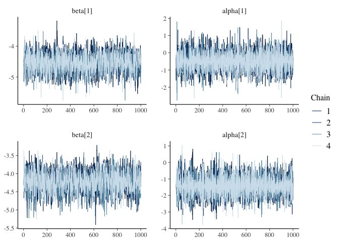
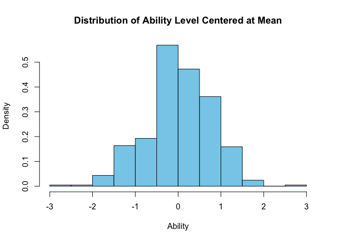
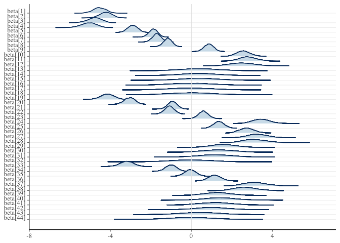

# Homework 8 Project Report
Alyssa Kam

- [Research Question](#research-question)
  - [Can a Bayesian Data Analysis model converge when applied to an IRT
    model of Vocabulary ability, with missing items in different
    versions?](#can-a-bayesian-data-analysis-model-converge-when-applied-to-an-irt-model-of-vocabulary-ability-with-missing-items-in-different-versions)
- [Add relevant packages](#add-relevant-packages)
- [Read in Child data - Wechsler Intelligence Scale for Children
  (WISC)](#read-in-child-data---wechsler-intelligence-scale-for-children-wisc)
- [Remove the X column that has the row
  number](#remove-the-x-column-that-has-the-row-number)
- [Description of each variable](#description-of-each-variable)
- [Only keep 7 year olds](#only-keep-7-year-olds)
- [Keep only 1 twin in the pair](#keep-only-1-twin-in-the-pair)
- [Convert data to long format](#convert-data-to-long-format)
- [Convert the item and ID variable to
  numeric](#convert-the-item-and-id-variable-to-numeric)
- [For the 1pl model, convert to
  binary](#for-the-1pl-model-convert-to-binary)
- [Exclude NA on “response”](#exclude-na-on-response)
- [Call the stan model](#call-the-stan-model)
- [Model and Priors](#model-and-priors)
  - [Model](#model)
  - [Priors](#priors)
- [Make data frame and declare
  variables](#make-data-frame-and-declare-variables)
- [Fit the model with the data](#fit-the-model-with-the-data)
- [Convergence check with first 2 items and first 2
  individuals](#convergence-check-with-first-2-items-and-first-2-individuals)
- [Parameter coefficient summary of delta, beta, and
  alpha](#parameter-coefficient-summary-of-delta-beta-and-alpha)
- [Posterior Distribution of the beta, or difficulty level for each
  item](#posterior-distribution-of-the-beta-or-difficulty-level-for-each-item)
- [Intepretations](#intepretations)

## Research Question

### Can a Bayesian Data Analysis model converge when applied to an IRT model of Vocabulary ability, with missing items in different versions?

## Add relevant packages

``` r
library(dplyr)
library(base)
library(cmdstanr)
library(tidyverse)
library(bayesplot)
library(posterior)
```

## Read in Child data - Wechsler Intelligence Scale for Children (WISC)

``` r
getwd()
```

    [1] "/Users/alyssakam/Documents/PSYC-573/Project"

``` r
wiscall <- read.csv("PSYC-573_LTS.csv", header = TRUE)
```

## Remove the X column that has the row number

``` r
wiscall <- wiscall[,-1]
```

## Description of each variable

``` r
names(wiscall)
```

     [1] "ID"      "FAMID"   "Age"     "Version" "item1"   "item2"   "item3"  
     [8] "item4"   "item5"   "item6"   "item7"   "item8"   "item9"   "item10" 
    [15] "item11"  "item12"  "item13"  "item14"  "item15"  "item16"  "item17" 
    [22] "item18"  "item19"  "item20"  "item21"  "item22"  "item23"  "item24" 
    [29] "item25"  "item26"  "item27"  "item28"  "item29"  "item30"  "item31" 
    [36] "item32"  "item33"  "item34"  "item35"  "item36"  "item37"  "item38" 
    [43] "item39"  "item40"  "item41"  "item42"  "item43"  "item44" 

`ID` = ID variable unique for each twin

`FAMID` = ID variable unique for each pair

`Age` = Age of twin in years, rounded to nearest whole year

`Version` = Wechsler test version; -1 = WISC, 0 = WISC-R, 1 = WISC-III

`item 1-44` = all items, unique and common across test versions

An individual may have a missing value for an item for any of the
following reasons:

1.  The item did not appear on the version of the test the individual
    took

2.  The individual met the discontinue rule (Ex: stop administration if
    get 5 0s in a row)

## Only keep 7 year olds

``` r
wiscall7 <- wiscall[wiscall$Age == 7,]
```

## Keep only 1 twin in the pair

``` r
famid <- unique(wiscall7$FAMID)
wiscall7_single <- data.frame(wiscall7[1,])
wiscall7_single <-wiscall7_single[-1,]
for(j in 1:length(famid)){
  #make a tall data frame of every observation for selected cluster variable
  df <- wiscall7[which(famid[j] == wiscall7$FAMID),]
  df <- arrange(df, FAMID)
  #take the last observation
  last <- tail(df, 1)
  #add it to the empty data frame
  wiscall7_single <- rbind(wiscall7_single, last)
}
```

## Convert data to long format

``` r
wiscall7_single_long <- wiscall7_single |>
  pivot_longer(
    cols = 5:48,
    names_to = "item",
    values_to = "response")
```

## Convert the item and ID variable to numeric

``` r
wiscall7_single_long$item <- as.numeric(factor(wiscall7_single_long$item, levels=unique(wiscall7_single_long$item)))
wiscall7_single_long$ID <- as.numeric(as.factor(wiscall7_single_long$ID))
```

## For the 1pl model, convert to binary

``` r
wiscall7_single_long$response[wiscall7_single_long$response == 2] <- 1
```

## Exclude NA on “response”

``` r
data_complete <- wiscall7_single_long[complete.cases(wiscall7_single_long$response), ]
```

## Call the stan model

``` r
mod <- cmdstan_model("onepl.stan")
```

## Model and Priors

### Model

![Pr\[y\_{n} = 1\] = logit^{-1} (\alpha\_{jj\[n\]} - \beta\_{kk\[n\]} + \delta)](https://latex.codecogs.com/svg.latex?Pr%5By_%7Bn%7D%20%3D%201%5D%20%3D%20logit%5E%7B-1%7D%20%28%5Calpha_%7Bjj%5Bn%5D%7D%20-%20%5Cbeta_%7Bkk%5Bn%5D%7D%20%2B%20%5Cdelta%29 "Pr[y_{n} = 1] = logit^{-1} (\alpha_{jj[n]} - \beta_{kk[n]} + \delta)")

### Priors

")

")

")

## Make data frame and declare variables

``` r
stan_data <- list(
  J = 415, #sample size
  K = 44, #number of unique items
  N = nrow(data_complete), #of total observations
  jj = data_complete$ID, #each person
  kk = data_complete$item, #each item
  y = data_complete$response #response coded as 0/1
)
```

## Fit the model with the data

``` r
fit <- mod$sample(
  data = stan_data,
  seed = 123,
  chains = 4,
  parallel_chains = 4
)
```

## Convergence check with first 2 items and first 2 individuals

``` r
fit_post_draws <- fit$draws(c("beta[1]", "alpha[1]",
                              "beta[2]", "alpha[2]"))
mcmc_trace(fit_post_draws)
```



## Parameter coefficient summary of delta, beta, and alpha

``` r
fit_summ <- fit$summary(c("delta", "beta", "alpha"))
```

    Warning: The ESS has been capped to avoid unstable estimates.

``` r
# Use `knitr::kable()` for tabulation
knitr::kable(fit_summ, digits = 2)
```

| variable     |  mean | median |   sd |  mad |    q5 |   q95 | rhat | ess_bulk | ess_tail |
|:-------------|------:|-------:|-----:|-----:|------:|------:|-----:|---------:|---------:|
| delta        | -0.76 |  -0.75 | 0.19 | 0.19 | -1.07 | -0.45 | 1.00 |   938.82 |  1728.82 |
| beta\[1\]    | -4.54 |  -4.54 | 0.31 | 0.31 | -5.08 | -4.05 | 1.00 |  2168.71 |  2339.09 |
| beta\[2\]    | -4.22 |  -4.22 | 0.30 | 0.30 | -4.72 | -3.75 | 1.00 |  2137.06 |  2658.84 |
| beta\[3\]    | -4.77 |  -4.77 | 0.34 | 0.34 | -5.37 | -4.23 | 1.00 |  2565.38 |  2558.35 |
| beta\[4\]    | -5.06 |  -5.06 | 0.36 | 0.36 | -5.68 | -4.50 | 1.00 |  3081.86 |  2672.19 |
| beta\[5\]    | -2.89 |  -2.89 | 0.24 | 0.24 | -3.28 | -2.51 | 1.00 |  1286.45 |  2250.76 |
| beta\[6\]    | -1.88 |  -1.87 | 0.21 | 0.21 | -2.24 | -1.53 | 1.00 |  1125.15 |  2030.86 |
| beta\[7\]    | -1.70 |  -1.70 | 0.21 | 0.21 | -2.05 | -1.36 | 1.00 |  1122.08 |  1829.82 |
| beta\[8\]    | -1.16 |  -1.16 | 0.21 | 0.20 | -1.51 | -0.83 | 1.00 |  1188.48 |  1892.63 |
| beta\[9\]    |  0.87 |   0.87 | 0.23 | 0.23 |  0.50 |  1.23 | 1.00 |  1221.71 |  2261.07 |
| beta\[10\]   |  2.57 |   2.56 | 0.32 | 0.32 |  2.05 |  3.12 | 1.00 |  2178.33 |  2557.46 |
| beta\[11\]   |  2.79 |   2.78 | 0.41 | 0.40 |  2.13 |  3.49 | 1.00 |  3611.10 |  2690.85 |
| beta\[12\]   |  2.51 |   2.50 | 0.61 | 0.61 |  1.55 |  3.52 | 1.00 |  7563.62 |  2731.94 |
| beta\[13\]   |  0.38 |   0.37 | 0.91 | 0.91 | -1.09 |  1.88 | 1.00 | 10395.55 |  2568.90 |
| beta\[14\]   |  0.37 |   0.36 | 0.90 | 0.87 | -1.11 |  1.85 | 1.00 | 11448.79 |  2867.46 |
| beta\[15\]   |  0.38 |   0.39 | 0.91 | 0.88 | -1.16 |  1.90 | 1.00 |  8301.05 |  2555.77 |
| beta\[16\]   | -0.01 |  -0.02 | 0.97 | 0.97 | -1.60 |  1.62 | 1.00 | 11317.18 |  3097.04 |
| beta\[17\]   | -0.02 |  -0.03 | 1.02 | 1.06 | -1.70 |  1.69 | 1.00 | 10462.16 |  2892.13 |
| beta\[18\]   |  0.01 |   0.00 | 0.96 | 0.97 | -1.55 |  1.60 | 1.00 | 10826.99 |  2674.05 |
| beta\[19\]   | -4.15 |  -4.14 | 0.32 | 0.32 | -4.70 | -3.62 | 1.00 |  2226.66 |  2780.33 |
| beta\[20\]   | -3.04 |  -3.04 | 0.26 | 0.26 | -3.48 | -2.63 | 1.00 |  1574.97 |  2290.51 |
| beta\[21\]   | -0.93 |  -0.93 | 0.22 | 0.22 | -1.30 | -0.56 | 1.00 |  1131.63 |  1973.43 |
| beta\[22\]   | -1.08 |  -1.08 | 0.22 | 0.22 | -1.44 | -0.71 | 1.00 |  1190.28 |  2114.26 |
| beta\[23\]   |  0.59 |   0.59 | 0.23 | 0.23 |  0.21 |  0.98 | 1.00 |  1337.65 |  2330.31 |
| beta\[24\]   |  3.45 |   3.44 | 0.41 | 0.41 |  2.80 |  4.13 | 1.00 |  3910.37 |  2754.57 |
| beta\[25\]   |  1.36 |   1.36 | 0.26 | 0.25 |  0.94 |  1.79 | 1.00 |  1531.90 |  2393.93 |
| beta\[26\]   |  2.74 |   2.74 | 0.35 | 0.35 |  2.18 |  3.34 | 1.00 |  2587.16 |  2690.24 |
| beta\[27\]   |  3.29 |   3.26 | 0.50 | 0.49 |  2.50 |  4.14 | 1.00 |  4941.77 |  2482.29 |
| beta\[28\]   |  3.14 |   3.10 | 0.55 | 0.55 |  2.28 |  4.08 | 1.00 |  6223.19 |  3078.12 |
| beta\[29\]   |  1.59 |   1.58 | 0.62 | 0.62 |  0.59 |  2.64 | 1.00 |  7606.01 |  2996.00 |
| beta\[30\]   |  1.35 |   1.35 | 0.77 | 0.79 |  0.11 |  2.61 | 1.00 |  9351.87 |  2869.02 |
| beta\[31\]   |  1.18 |   1.17 | 0.81 | 0.82 | -0.17 |  2.51 | 1.00 |  8631.22 |  2735.20 |
| beta\[32\]   | -0.01 |  -0.01 | 1.00 | 1.00 | -1.62 |  1.58 | 1.00 | 10864.06 |  2645.63 |
| beta\[33\]   | -3.19 |  -3.19 | 0.33 | 0.33 | -3.75 | -2.65 | 1.00 |  2242.90 |  2482.57 |
| beta\[34\]   | -1.00 |  -1.00 | 0.27 | 0.27 | -1.45 | -0.55 | 1.00 |  1607.92 |  2450.01 |
| beta\[35\]   | -0.05 |  -0.05 | 0.27 | 0.27 | -0.49 |  0.40 | 1.00 |  1698.68 |  2346.26 |
| beta\[36\]   |  1.16 |   1.15 | 0.30 | 0.30 |  0.67 |  1.65 | 1.00 |  2056.05 |  2591.21 |
| beta\[37\]   |  3.14 |   3.13 | 0.51 | 0.52 |  2.34 |  4.02 | 1.00 |  4678.91 |  2545.79 |
| beta\[38\]   |  2.67 |   2.64 | 0.53 | 0.53 |  1.85 |  3.57 | 1.00 |  5548.91 |  2306.74 |
| beta\[39\]   |  1.30 |   1.29 | 0.64 | 0.63 |  0.28 |  2.38 | 1.00 |  6792.33 |  3152.81 |
| beta\[40\]   |  1.41 |   1.41 | 0.77 | 0.74 |  0.15 |  2.70 | 1.01 | 10901.94 |  2569.36 |
| beta\[41\]   |  1.19 |   1.19 | 0.76 | 0.76 | -0.02 |  2.45 | 1.00 |  8677.41 |  2925.09 |
| beta\[42\]   |  1.01 |   1.01 | 0.82 | 0.79 | -0.35 |  2.40 | 1.00 | 10560.15 |  2876.57 |
| beta\[43\]   |  0.44 |   0.43 | 0.88 | 0.89 | -0.99 |  1.87 | 1.00 |  8440.42 |  3156.83 |
| beta\[44\]   |  0.00 |  -0.01 | 0.96 | 0.95 | -1.56 |  1.58 | 1.00 |  9759.13 |  3131.00 |
| alpha\[1\]   | -0.49 |  -0.50 | 0.58 | 0.59 | -1.41 |  0.47 | 1.00 | 12803.48 |  2764.33 |
| alpha\[2\]   | -1.43 |  -1.43 | 0.63 | 0.63 | -2.44 | -0.39 | 1.00 | 12208.03 |  2399.58 |
| alpha\[3\]   | -0.11 |  -0.12 | 0.61 | 0.62 | -1.10 |  0.91 | 1.00 | 11374.14 |  2767.89 |
| alpha\[4\]   | -0.47 |  -0.48 | 0.60 | 0.59 | -1.44 |  0.51 | 1.00 | 11711.49 |  2809.34 |
| alpha\[5\]   | -0.11 |  -0.12 | 0.60 | 0.58 | -1.08 |  0.87 | 1.00 | 10835.55 |  2643.45 |
| alpha\[6\]   | -1.10 |  -1.12 | 0.59 | 0.59 | -2.04 | -0.13 | 1.00 | 10428.76 |  2561.22 |
| alpha\[7\]   |  1.17 |   1.15 | 0.60 | 0.58 |  0.18 |  2.17 | 1.00 | 10931.11 |  2365.48 |
| alpha\[8\]   | -0.47 |  -0.48 | 0.62 | 0.61 | -1.49 |  0.57 | 1.00 | 11791.66 |  2746.38 |
| alpha\[9\]   |  1.56 |   1.56 | 0.62 | 0.63 |  0.56 |  2.56 | 1.00 | 13202.96 |  2569.12 |
| alpha\[10\]  |  1.21 |   1.21 | 0.60 | 0.62 |  0.20 |  2.19 | 1.00 |  9591.08 |  2608.85 |
| alpha\[11\]  | -0.81 |  -0.82 | 0.58 | 0.59 | -1.74 |  0.15 | 1.00 |  9480.12 |  2615.35 |
| alpha\[12\]  | -0.15 |  -0.15 | 0.59 | 0.58 | -1.09 |  0.82 | 1.00 | 10370.13 |  2996.88 |
| alpha\[13\]  | -0.08 |  -0.09 | 0.61 | 0.62 | -1.06 |  0.93 | 1.00 | 12058.72 |  2451.99 |
| alpha\[14\]  | -2.16 |  -2.15 | 0.57 | 0.58 | -3.09 | -1.23 | 1.00 | 10462.22 |  2873.56 |
| alpha\[15\]  |  1.21 |   1.20 | 0.57 | 0.56 |  0.26 |  2.16 | 1.00 | 11687.91 |  2787.63 |
| alpha\[16\]  |  0.20 |   0.20 | 0.60 | 0.60 | -0.78 |  1.19 | 1.00 |  9924.37 |  2844.10 |
| alpha\[17\]  | -0.13 |  -0.13 | 0.56 | 0.56 | -1.07 |  0.80 | 1.00 |  8872.93 |  2856.26 |
| alpha\[18\]  | -1.71 |  -1.71 | 0.59 | 0.60 | -2.70 | -0.73 | 1.00 |  8803.25 |  3091.13 |
| alpha\[19\]  |  0.77 |   0.77 | 0.56 | 0.55 | -0.16 |  1.68 | 1.00 |  9312.49 |  2705.89 |
| alpha\[20\]  |  0.23 |   0.23 | 0.58 | 0.59 | -0.70 |  1.18 | 1.00 | 10845.23 |  3142.99 |
| alpha\[21\]  | -0.06 |  -0.07 | 0.60 | 0.58 | -1.03 |  0.95 | 1.00 | 10490.31 |  2759.97 |
| alpha\[22\]  | -0.12 |  -0.13 | 0.60 | 0.61 | -1.09 |  0.86 | 1.00 |  8344.10 |  2931.83 |
| alpha\[23\]  | -0.75 |  -0.76 | 0.60 | 0.59 | -1.75 |  0.24 | 1.00 |  9344.66 |  2625.30 |
| alpha\[24\]  |  0.56 |   0.56 | 0.61 | 0.63 | -0.41 |  1.56 | 1.00 | 10945.62 |  2700.40 |
| alpha\[25\]  |  0.20 |   0.19 | 0.58 | 0.57 | -0.73 |  1.18 | 1.01 |  9970.79 |  2772.74 |
| alpha\[26\]  | -1.33 |  -1.32 | 0.62 | 0.62 | -2.33 | -0.33 | 1.00 | 10269.74 |  2519.95 |
| alpha\[27\]  |  0.23 |   0.23 | 0.60 | 0.61 | -0.75 |  1.22 | 1.00 |  9932.27 |  2683.83 |
| alpha\[28\]  |  1.28 |   1.28 | 0.60 | 0.59 |  0.24 |  2.28 | 1.00 | 11372.62 |  2356.40 |
| alpha\[29\]  | -0.07 |  -0.07 | 0.60 | 0.59 | -1.07 |  0.92 | 1.00 | 10172.33 |  2644.31 |
| alpha\[30\]  |  0.23 |   0.22 | 0.58 | 0.58 | -0.71 |  1.19 | 1.00 |  9438.24 |  2984.51 |
| alpha\[31\]  |  1.28 |   1.27 | 0.61 | 0.62 |  0.30 |  2.28 | 1.00 | 11232.00 |  2821.29 |
| alpha\[32\]  |  0.23 |   0.23 | 0.60 | 0.61 | -0.75 |  1.26 | 1.00 | 10677.66 |  2925.81 |
| alpha\[33\]  | -0.82 |  -0.82 | 0.58 | 0.59 | -1.77 |  0.17 | 1.00 | 10132.66 |  2742.05 |
| alpha\[34\]  |  0.58 |   0.58 | 0.51 | 0.51 | -0.25 |  1.40 | 1.00 |  7618.38 |  3212.53 |
| alpha\[35\]  |  0.82 |   0.83 | 0.59 | 0.58 | -0.17 |  1.80 | 1.00 | 14408.24 |  2071.77 |
| alpha\[36\]  |  0.92 |   0.92 | 0.61 | 0.61 | -0.08 |  1.94 | 1.00 | 10659.17 |  3031.18 |
| alpha\[37\]  | -0.13 |  -0.14 | 0.60 | 0.60 | -1.09 |  0.87 | 1.00 | 10390.25 |  2703.62 |
| alpha\[38\]  |  1.24 |   1.24 | 0.60 | 0.59 |  0.25 |  2.23 | 1.00 | 11010.23 |  2307.57 |
| alpha\[39\]  |  1.21 |   1.20 | 0.58 | 0.56 |  0.27 |  2.18 | 1.00 | 10539.19 |  2711.97 |
| alpha\[40\]  | -0.47 |  -0.48 | 0.59 | 0.57 | -1.44 |  0.53 | 1.00 |  9970.14 |  2776.73 |
| alpha\[41\]  | -0.44 |  -0.45 | 0.60 | 0.60 | -1.43 |  0.56 | 1.00 | 10721.65 |  2653.24 |
| alpha\[42\]  |  0.18 |   0.18 | 0.59 | 0.61 | -0.79 |  1.14 | 1.00 |  9793.41 |  2490.85 |
| alpha\[43\]  |  0.19 |   0.18 | 0.60 | 0.58 | -0.82 |  1.17 | 1.00 | 10266.18 |  2789.49 |
| alpha\[44\]  |  1.17 |   1.18 | 0.59 | 0.59 |  0.18 |  2.13 | 1.00 |  9460.80 |  2538.44 |
| alpha\[45\]  |  0.23 |   0.23 | 0.61 | 0.59 | -0.76 |  1.24 | 1.00 |  9949.35 |  2307.28 |
| alpha\[46\]  | -0.80 |  -0.81 | 0.59 | 0.59 | -1.77 |  0.17 | 1.00 |  8967.68 |  2538.97 |
| alpha\[47\]  |  0.55 |   0.54 | 0.59 | 0.60 | -0.40 |  1.52 | 1.00 |  8828.09 |  2967.33 |
| alpha\[48\]  |  0.55 |   0.55 | 0.58 | 0.60 | -0.42 |  1.49 | 1.00 | 11079.66 |  2865.84 |
| alpha\[49\]  |  0.56 |   0.57 | 0.60 | 0.62 | -0.44 |  1.53 | 1.00 | 11480.12 |  3146.27 |
| alpha\[50\]  |  0.24 |   0.24 | 0.60 | 0.60 | -0.74 |  1.23 | 1.00 | 10020.65 |  2671.86 |
| alpha\[51\]  |  0.56 |   0.56 | 0.61 | 0.61 | -0.45 |  1.58 | 1.00 | 10243.90 |  2772.44 |
| alpha\[52\]  | -0.15 |  -0.16 | 0.60 | 0.59 | -1.12 |  0.83 | 1.00 | 11661.85 |  3177.14 |
| alpha\[53\]  | -0.44 |  -0.44 | 0.61 | 0.60 | -1.40 |  0.55 | 1.00 |  9492.55 |  2724.96 |
| alpha\[54\]  |  0.20 |   0.19 | 0.59 | 0.58 | -0.78 |  1.19 | 1.00 | 13614.53 |  2701.77 |
| alpha\[55\]  |  1.39 |   1.39 | 0.58 | 0.57 |  0.43 |  2.34 | 1.00 | 11331.30 |  2613.08 |
| alpha\[56\]  | -1.43 |  -1.44 | 0.59 | 0.58 | -2.40 | -0.45 | 1.00 | 10269.32 |  2568.53 |
| alpha\[57\]  | -2.00 |  -2.01 | 0.63 | 0.63 | -3.00 | -0.97 | 1.00 | 10961.82 |  2916.18 |
| alpha\[58\]  | -0.78 |  -0.78 | 0.59 | 0.56 | -1.75 |  0.20 | 1.00 | 11760.85 |  2808.48 |
| alpha\[59\]  | -0.81 |  -0.81 | 0.59 | 0.59 | -1.78 |  0.18 | 1.00 | 11491.63 |  2572.33 |
| alpha\[60\]  |  0.59 |   0.58 | 0.62 | 0.63 | -0.40 |  1.62 | 1.00 | 10486.77 |  2546.81 |
| alpha\[61\]  |  0.20 |   0.20 | 0.59 | 0.59 | -0.77 |  1.17 | 1.00 | 10444.08 |  2640.86 |
| alpha\[62\]  |  0.98 |   0.99 | 0.57 | 0.57 |  0.05 |  1.89 | 1.00 | 10200.00 |  2950.42 |
| alpha\[63\]  |  0.23 |   0.23 | 0.61 | 0.62 | -0.77 |  1.23 | 1.00 | 10599.87 |  2530.89 |
| alpha\[64\]  |  1.22 |   1.22 | 0.58 | 0.57 |  0.24 |  2.18 | 1.00 |  9458.59 |  3004.04 |
| alpha\[65\]  | -0.14 |  -0.15 | 0.58 | 0.59 | -1.09 |  0.81 | 1.00 | 10740.07 |  2981.35 |
| alpha\[66\]  | -0.47 |  -0.47 | 0.59 | 0.58 | -1.43 |  0.47 | 1.00 |  9982.65 |  3053.30 |
| alpha\[67\]  |  1.21 |   1.21 | 0.59 | 0.60 |  0.27 |  2.19 | 1.00 | 10376.91 |  2963.97 |
| alpha\[68\]  |  0.59 |   0.59 | 0.62 | 0.62 | -0.43 |  1.64 | 1.00 | 11048.80 |  2309.16 |
| alpha\[69\]  | -0.47 |  -0.48 | 0.60 | 0.60 | -1.45 |  0.50 | 1.00 |  9995.43 |  2503.27 |
| alpha\[70\]  | -0.09 |  -0.10 | 0.60 | 0.60 | -1.05 |  0.89 | 1.00 | 11048.23 |  2918.20 |
| alpha\[71\]  | -0.14 |  -0.14 | 0.59 | 0.58 | -1.11 |  0.85 | 1.00 | 10030.57 |  2819.44 |
| alpha\[72\]  | -0.49 |  -0.49 | 0.58 | 0.58 | -1.46 |  0.46 | 1.00 | 11261.92 |  2791.95 |
| alpha\[73\]  | -0.49 |  -0.49 | 0.59 | 0.61 | -1.43 |  0.47 | 1.00 |  8655.83 |  2496.04 |
| alpha\[74\]  | -1.11 |  -1.11 | 0.59 | 0.59 | -2.08 | -0.14 | 1.00 | 10935.90 |  2766.46 |
| alpha\[75\]  | -0.48 |  -0.48 | 0.58 | 0.60 | -1.43 |  0.49 | 1.00 | 10712.57 |  2900.21 |
| alpha\[76\]  |  0.21 |   0.20 | 0.60 | 0.62 | -0.76 |  1.21 | 1.00 |  9553.19 |  2915.73 |
| alpha\[77\]  |  0.86 |   0.86 | 0.59 | 0.59 | -0.10 |  1.84 | 1.00 | 10231.13 |  2889.39 |
| alpha\[78\]  | -1.13 |  -1.12 | 0.58 | 0.57 | -2.09 | -0.18 | 1.00 | 10619.72 |  2579.39 |
| alpha\[79\]  | -1.07 |  -1.07 | 0.62 | 0.59 | -2.09 | -0.02 | 1.00 | 11261.64 |  2568.47 |
| alpha\[80\]  | -0.46 |  -0.47 | 0.61 | 0.62 | -1.45 |  0.54 | 1.00 | 10982.22 |  2846.76 |
| alpha\[81\]  | -0.48 |  -0.48 | 0.58 | 0.57 | -1.44 |  0.46 | 1.00 | 12267.18 |  2424.67 |
| alpha\[82\]  |  0.19 |   0.19 | 0.59 | 0.59 | -0.79 |  1.20 | 1.00 | 11626.29 |  2941.68 |
| alpha\[83\]  | -0.07 |  -0.08 | 0.61 | 0.60 | -1.05 |  0.93 | 1.00 | 10377.27 |  2801.56 |
| alpha\[84\]  |  0.22 |   0.21 | 0.63 | 0.63 | -0.81 |  1.27 | 1.00 |  9720.16 |  2383.54 |
| alpha\[85\]  | -1.07 |  -1.08 | 0.61 | 0.61 | -2.09 | -0.04 | 1.00 | 11478.24 |  2885.14 |
| alpha\[86\]  | -0.13 |  -0.14 | 0.59 | 0.60 | -1.07 |  0.84 | 1.00 | 10693.94 |  2928.34 |
| alpha\[87\]  | -0.15 |  -0.15 | 0.57 | 0.58 | -1.07 |  0.77 | 1.00 |  7964.41 |  2989.02 |
| alpha\[88\]  | -0.47 |  -0.47 | 0.59 | 0.58 | -1.42 |  0.51 | 1.00 | 12608.46 |  2988.09 |
| alpha\[89\]  | -0.13 |  -0.12 | 0.59 | 0.58 | -1.09 |  0.86 | 1.00 | 11255.88 |  2948.12 |
| alpha\[90\]  | -0.46 |  -0.47 | 0.61 | 0.61 | -1.46 |  0.54 | 1.00 | 10664.45 |  2930.53 |
| alpha\[91\]  | -0.15 |  -0.15 | 0.60 | 0.60 | -1.14 |  0.83 | 1.00 | 12213.89 |  2543.26 |
| alpha\[92\]  | -1.07 |  -1.07 | 0.58 | 0.56 | -2.04 | -0.10 | 1.00 |  9015.78 |  2688.68 |
| alpha\[93\]  | -0.49 |  -0.49 | 0.56 | 0.57 | -1.41 |  0.46 | 1.00 |  8673.09 |  2963.52 |
| alpha\[94\]  | -1.48 |  -1.48 | 0.59 | 0.57 | -2.43 | -0.48 | 1.00 |  9771.79 |  2564.42 |
| alpha\[95\]  | -1.07 |  -1.08 | 0.60 | 0.59 | -2.08 | -0.08 | 1.00 | 12467.82 |  2201.16 |
| alpha\[96\]  | -1.43 |  -1.42 | 0.60 | 0.61 | -2.41 | -0.42 | 1.00 | 11828.97 |  2609.52 |
| alpha\[97\]  | -0.14 |  -0.16 | 0.58 | 0.57 | -1.10 |  0.83 | 1.00 | 10515.98 |  2762.12 |
| alpha\[98\]  |  0.20 |   0.21 | 0.59 | 0.58 | -0.74 |  1.18 | 1.00 | 11716.36 |  3053.73 |
| alpha\[99\]  | -0.08 |  -0.08 | 0.60 | 0.60 | -1.06 |  0.92 | 1.00 | 10149.99 |  2485.88 |
| alpha\[100\] | -0.78 |  -0.78 | 0.58 | 0.57 | -1.73 |  0.19 | 1.00 | 10876.46 |  3073.34 |
| alpha\[101\] | -3.00 |  -3.00 | 0.63 | 0.62 | -4.01 | -1.97 | 1.00 | 10092.58 |  3101.15 |
| alpha\[102\] |  0.51 |   0.52 | 0.60 | 0.59 | -0.47 |  1.51 | 1.00 | 10310.59 |  2514.41 |
| alpha\[103\] | -0.49 |  -0.49 | 0.58 | 0.58 | -1.44 |  0.47 | 1.00 | 10645.44 |  3184.69 |
| alpha\[104\] | -0.14 |  -0.15 | 0.58 | 0.58 | -1.09 |  0.82 | 1.00 | 10674.24 |  3050.18 |
| alpha\[105\] | -1.12 |  -1.13 | 0.58 | 0.59 | -2.07 | -0.16 | 1.00 | 11358.14 |  2810.85 |
| alpha\[106\] |  0.21 |   0.22 | 0.61 | 0.64 | -0.80 |  1.23 | 1.00 |  8503.24 |  2999.00 |
| alpha\[107\] |  0.92 |   0.91 | 0.62 | 0.63 | -0.08 |  1.93 | 1.00 | 11349.85 |  2879.04 |
| alpha\[108\] |  0.21 |   0.21 | 0.57 | 0.58 | -0.72 |  1.15 | 1.00 |  9337.23 |  2981.12 |
| alpha\[109\] | -0.47 |  -0.47 | 0.59 | 0.61 | -1.45 |  0.49 | 1.00 |  8405.71 |  2906.09 |
| alpha\[110\] |  0.22 |   0.22 | 0.59 | 0.62 | -0.76 |  1.17 | 1.00 | 10062.06 |  2749.67 |
| alpha\[111\] |  1.27 |   1.28 | 0.60 | 0.60 |  0.30 |  2.26 | 1.00 | 10636.67 |  2526.96 |
| alpha\[112\] |  0.45 |   0.45 | 0.59 | 0.58 | -0.53 |  1.43 | 1.00 |  9645.86 |  2480.57 |
| alpha\[113\] |  1.08 |   1.09 | 0.55 | 0.56 |  0.17 |  1.96 | 1.00 | 10662.82 |  2860.61 |
| alpha\[114\] | -0.14 |  -0.14 | 0.58 | 0.58 | -1.08 |  0.82 | 1.00 | 12094.46 |  2332.67 |
| alpha\[115\] | -0.47 |  -0.48 | 0.59 | 0.60 | -1.45 |  0.51 | 1.00 |  9795.49 |  2808.99 |
| alpha\[116\] | -1.07 |  -1.09 | 0.62 | 0.64 | -2.06 | -0.06 | 1.00 | 10654.37 |  2894.28 |
| alpha\[117\] | -1.15 |  -1.16 | 0.59 | 0.58 | -2.11 | -0.18 | 1.00 |  8889.80 |  2765.44 |
| alpha\[118\] | -0.13 |  -0.13 | 0.59 | 0.61 | -1.08 |  0.86 | 1.00 |  9698.93 |  2187.82 |
| alpha\[119\] | -0.14 |  -0.13 | 0.58 | 0.57 | -1.10 |  0.80 | 1.00 | 10256.42 |  2433.40 |
| alpha\[120\] | -0.81 |  -0.80 | 0.57 | 0.58 | -1.75 |  0.14 | 1.00 |  9227.58 |  2874.41 |
| alpha\[121\] |  0.22 |   0.22 | 0.59 | 0.62 | -0.75 |  1.21 | 1.00 | 11187.67 |  2864.79 |
| alpha\[122\] |  0.51 |   0.52 | 0.58 | 0.59 | -0.45 |  1.46 | 1.00 | 10188.50 |  2736.94 |
| alpha\[123\] |  0.57 |   0.57 | 0.61 | 0.60 | -0.43 |  1.57 | 1.00 | 10065.82 |  3029.08 |
| alpha\[124\] | -0.43 |  -0.43 | 0.61 | 0.60 | -1.43 |  0.59 | 1.00 |  9735.48 |  2060.74 |
| alpha\[125\] |  0.56 |   0.55 | 0.59 | 0.56 | -0.40 |  1.56 | 1.00 | 10381.26 |  2537.67 |
| alpha\[126\] | -0.47 |  -0.47 | 0.59 | 0.56 | -1.44 |  0.49 | 1.00 |  9217.50 |  2698.15 |
| alpha\[127\] |  0.56 |   0.55 | 0.60 | 0.60 | -0.42 |  1.56 | 1.00 | 10030.56 |  3177.13 |
| alpha\[128\] | -0.44 |  -0.44 | 0.60 | 0.62 | -1.40 |  0.54 | 1.00 |  9114.68 |  2836.05 |
| alpha\[129\] | -0.47 |  -0.48 | 0.59 | 0.58 | -1.42 |  0.52 | 1.00 | 11979.79 |  2556.08 |
| alpha\[130\] |  0.24 |   0.23 | 0.60 | 0.59 | -0.75 |  1.24 | 1.01 | 10968.65 |  2265.75 |
| alpha\[131\] |  0.22 |   0.21 | 0.60 | 0.59 | -0.74 |  1.19 | 1.00 | 10918.06 |  3181.23 |
| alpha\[132\] |  0.91 |   0.91 | 0.59 | 0.59 | -0.05 |  1.90 | 1.00 | 10912.75 |  2896.35 |
| alpha\[133\] |  0.17 |   0.17 | 0.58 | 0.58 | -0.78 |  1.13 | 1.00 | 10274.72 |  2651.72 |
| alpha\[134\] | -0.82 |  -0.81 | 0.58 | 0.57 | -1.78 |  0.13 | 1.00 | 10023.91 |  2823.28 |
| alpha\[135\] | -1.11 |  -1.12 | 0.60 | 0.58 | -2.08 | -0.14 | 1.00 | 10160.55 |  2884.29 |
| alpha\[136\] | -0.79 |  -0.81 | 0.60 | 0.59 | -1.77 |  0.20 | 1.00 | 12632.55 |  2916.27 |
| alpha\[137\] |  0.24 |   0.23 | 0.63 | 0.65 | -0.76 |  1.26 | 1.00 | 10521.87 |  2264.93 |
| alpha\[138\] |  0.57 |   0.56 | 0.61 | 0.62 | -0.40 |  1.59 | 1.00 |  9812.51 |  2591.51 |
| alpha\[139\] |  0.87 |   0.87 | 0.60 | 0.61 | -0.11 |  1.84 | 1.00 | 10005.52 |  2565.55 |
| alpha\[140\] |  0.45 |   0.45 | 0.57 | 0.59 | -0.48 |  1.37 | 1.00 |  9595.41 |  2717.62 |
| alpha\[141\] |  0.23 |   0.23 | 0.59 | 0.58 | -0.72 |  1.23 | 1.00 | 11188.69 |  2758.39 |
| alpha\[142\] |  1.57 |   1.58 | 0.58 | 0.59 |  0.61 |  2.51 | 1.00 | 13599.25 |  2527.71 |
| alpha\[143\] | -1.10 |  -1.10 | 0.58 | 0.58 | -2.04 | -0.12 | 1.00 |  9299.08 |  2702.72 |
| alpha\[144\] |  0.55 |   0.54 | 0.60 | 0.59 | -0.40 |  1.54 | 1.00 | 11781.83 |  2612.48 |
| alpha\[145\] |  1.16 |   1.15 | 0.62 | 0.63 |  0.13 |  2.18 | 1.00 | 12020.50 |  2370.90 |
| alpha\[146\] | -0.12 |  -0.14 | 0.59 | 0.60 | -1.09 |  0.85 | 1.00 | 11699.65 |  2986.72 |
| alpha\[147\] |  0.23 |   0.21 | 0.61 | 0.61 | -0.76 |  1.24 | 1.00 | 10686.88 |  2725.46 |
| alpha\[148\] |  0.55 |   0.54 | 0.59 | 0.58 | -0.42 |  1.52 | 1.00 |  9613.34 |  2634.91 |
| alpha\[149\] |  1.55 |   1.55 | 0.59 | 0.61 |  0.60 |  2.52 | 1.00 | 11154.47 |  2922.98 |
| alpha\[150\] |  0.17 |   0.17 | 0.59 | 0.60 | -0.78 |  1.15 | 1.00 | 10897.40 |  2826.71 |
| alpha\[151\] |  0.88 |   0.87 | 0.59 | 0.59 | -0.09 |  1.86 | 1.00 |  9752.93 |  2881.29 |
| alpha\[152\] |  0.91 |   0.91 | 0.60 | 0.61 | -0.05 |  1.89 | 1.00 | 10975.42 |  3172.07 |
| alpha\[153\] | -0.47 |  -0.47 | 0.60 | 0.60 | -1.43 |  0.50 | 1.00 |  9212.27 |  2426.55 |
| alpha\[154\] | -0.49 |  -0.48 | 0.61 | 0.61 | -1.49 |  0.49 | 1.00 | 12081.90 |  2781.75 |
| alpha\[155\] | -0.45 |  -0.46 | 0.60 | 0.59 | -1.42 |  0.54 | 1.00 | 10699.15 |  2615.17 |
| alpha\[156\] |  0.22 |   0.22 | 0.62 | 0.60 | -0.81 |  1.23 | 1.00 |  9953.54 |  2563.34 |
| alpha\[157\] |  0.55 |   0.54 | 0.61 | 0.62 | -0.44 |  1.56 | 1.00 |  9922.24 |  2669.88 |
| alpha\[158\] | -1.16 |  -1.16 | 0.59 | 0.60 | -2.13 | -0.18 | 1.00 |  9877.80 |  2010.88 |
| alpha\[159\] |  0.23 |   0.23 | 0.60 | 0.60 | -0.74 |  1.25 | 1.00 | 11563.33 |  2375.84 |
| alpha\[160\] | -1.07 |  -1.07 | 0.61 | 0.61 | -2.04 | -0.07 | 1.00 | 10651.63 |  2615.38 |
| alpha\[161\] |  0.93 |   0.93 | 0.61 | 0.61 | -0.07 |  1.94 | 1.00 | 10524.55 |  2717.71 |
| alpha\[162\] | -0.13 |  -0.14 | 0.61 | 0.62 | -1.10 |  0.88 | 1.00 | 10885.35 |  2592.77 |
| alpha\[163\] | -0.43 |  -0.44 | 0.58 | 0.57 | -1.38 |  0.55 | 1.00 |  9532.68 |  2521.44 |
| alpha\[164\] |  0.56 |   0.54 | 0.60 | 0.60 | -0.41 |  1.56 | 1.00 |  9877.51 |  2911.77 |
| alpha\[165\] |  0.59 |   0.59 | 0.61 | 0.62 | -0.40 |  1.59 | 1.00 |  9081.29 |  2498.44 |
| alpha\[166\] |  0.56 |   0.54 | 0.61 | 0.62 | -0.44 |  1.57 | 1.00 |  9621.17 |  3009.41 |
| alpha\[167\] | -0.12 |  -0.12 | 0.58 | 0.56 | -1.09 |  0.86 | 1.00 | 11043.56 |  2741.93 |
| alpha\[168\] | -0.11 |  -0.12 | 0.60 | 0.61 | -1.11 |  0.90 | 1.00 | 11438.61 |  2596.27 |
| alpha\[169\] | -0.12 |  -0.12 | 0.59 | 0.58 | -1.07 |  0.87 | 1.00 |  8428.25 |  2495.78 |
| alpha\[170\] |  0.93 |   0.93 | 0.62 | 0.63 | -0.09 |  1.95 | 1.00 | 12591.43 |  2991.99 |
| alpha\[171\] | -1.49 |  -1.49 | 0.58 | 0.60 | -2.45 | -0.54 | 1.00 | 10333.63 |  2679.06 |
| alpha\[172\] |  0.56 |   0.57 | 0.60 | 0.62 | -0.44 |  1.55 | 1.00 |  9935.40 |  2903.13 |
| alpha\[173\] |  0.59 |   0.59 | 0.61 | 0.62 | -0.40 |  1.59 | 1.00 | 10305.80 |  2961.56 |
| alpha\[174\] | -1.78 |  -1.79 | 0.59 | 0.59 | -2.75 | -0.81 | 1.00 | 11109.49 |  2841.52 |
| alpha\[175\] | -0.48 |  -0.47 | 0.59 | 0.61 | -1.45 |  0.51 | 1.00 | 11260.38 |  2956.57 |
| alpha\[176\] |  0.24 |   0.23 | 0.61 | 0.62 | -0.76 |  1.24 | 1.00 | 10319.83 |  2685.23 |
| alpha\[177\] | -0.78 |  -0.79 | 0.59 | 0.59 | -1.73 |  0.19 | 1.00 |  9814.03 |  2435.26 |
| alpha\[178\] | -0.11 |  -0.12 | 0.59 | 0.61 | -1.06 |  0.83 | 1.00 |  9801.57 |  2626.90 |
| alpha\[179\] | -0.05 |  -0.05 | 0.60 | 0.61 | -1.05 |  0.94 | 1.00 | 10578.58 |  2639.73 |
| alpha\[180\] |  1.10 |   1.09 | 0.61 | 0.61 |  0.11 |  2.10 | 1.00 | 10598.57 |  2770.10 |
| alpha\[181\] | -0.40 |  -0.40 | 0.62 | 0.63 | -1.43 |  0.62 | 1.00 | 10351.78 |  2913.29 |
| alpha\[182\] | -1.60 |  -1.60 | 0.69 | 0.66 | -2.74 | -0.45 | 1.00 | 10635.26 |  2464.65 |
| alpha\[183\] | -0.81 |  -0.82 | 0.57 | 0.55 | -1.75 |  0.12 | 1.00 | 10745.03 |  3300.08 |
| alpha\[184\] | -0.38 |  -0.38 | 0.61 | 0.61 | -1.38 |  0.64 | 1.00 | 12026.00 |  2713.52 |
| alpha\[185\] |  1.14 |   1.13 | 0.60 | 0.62 |  0.14 |  2.15 | 1.00 | 10602.58 |  3026.36 |
| alpha\[186\] | -0.67 |  -0.68 | 0.63 | 0.63 | -1.68 |  0.35 | 1.00 |  9500.49 |  2950.21 |
| alpha\[187\] | -0.39 |  -0.39 | 0.59 | 0.60 | -1.34 |  0.58 | 1.00 | 10442.20 |  2913.42 |
| alpha\[188\] |  0.50 |   0.51 | 0.59 | 0.61 | -0.44 |  1.45 | 1.00 |  9565.86 |  3031.19 |
| alpha\[189\] | -0.81 |  -0.82 | 0.58 | 0.56 | -1.78 |  0.15 | 1.00 |  9154.20 |  2627.09 |
| alpha\[190\] | -0.13 |  -0.13 | 0.60 | 0.60 | -1.11 |  0.87 | 1.00 | 11078.62 |  2995.02 |
| alpha\[191\] | -0.13 |  -0.13 | 0.59 | 0.60 | -1.11 |  0.85 | 1.00 |  9133.81 |  2863.73 |
| alpha\[192\] |  1.28 |   1.28 | 0.60 | 0.59 |  0.29 |  2.26 | 1.00 |  8805.95 |  2730.96 |
| alpha\[193\] |  2.56 |   2.56 | 0.52 | 0.51 |  1.71 |  3.43 | 1.00 | 10127.64 |  2660.97 |
| alpha\[194\] |  0.22 |   0.22 | 0.61 | 0.60 | -0.80 |  1.25 | 1.00 | 10012.04 |  2544.22 |
| alpha\[195\] |  0.52 |   0.51 | 0.60 | 0.61 | -0.44 |  1.52 | 1.00 |  9606.25 |  2825.22 |
| alpha\[196\] |  0.22 |   0.22 | 0.60 | 0.60 | -0.78 |  1.21 | 1.00 | 12559.10 |  2994.73 |
| alpha\[197\] |  0.22 |   0.22 | 0.61 | 0.62 | -0.76 |  1.23 | 1.00 | 10941.09 |  2801.76 |
| alpha\[198\] |  0.21 |   0.20 | 0.59 | 0.59 | -0.77 |  1.17 | 1.00 |  8914.95 |  2633.52 |
| alpha\[199\] | -1.14 |  -1.14 | 0.59 | 0.60 | -2.11 | -0.18 | 1.00 |  9771.42 |  2675.45 |
| alpha\[200\] | -0.13 |  -0.14 | 0.59 | 0.61 | -1.10 |  0.83 | 1.00 | 10221.68 |  2818.98 |
| alpha\[201\] |  0.21 |   0.20 | 0.58 | 0.60 | -0.72 |  1.18 | 1.00 |  9641.64 |  2626.91 |
| alpha\[202\] | -0.82 |  -0.82 | 0.57 | 0.57 | -1.77 |  0.13 | 1.00 | 11199.59 |  2538.92 |
| alpha\[203\] |  0.91 |   0.90 | 0.59 | 0.59 | -0.05 |  1.91 | 1.00 | 10068.18 |  2332.44 |
| alpha\[204\] | -0.13 |  -0.13 | 0.58 | 0.59 | -1.09 |  0.83 | 1.00 | 10235.43 |  3109.15 |
| alpha\[205\] | -0.44 |  -0.43 | 0.60 | 0.60 | -1.43 |  0.57 | 1.00 | 10126.86 |  2432.59 |
| alpha\[206\] | -0.81 |  -0.82 | 0.60 | 0.60 | -1.80 |  0.19 | 1.00 |  8781.71 |  2819.93 |
| alpha\[207\] |  0.23 |   0.22 | 0.58 | 0.60 | -0.70 |  1.20 | 1.00 |  9994.45 |  2705.01 |
| alpha\[208\] |  0.91 |   0.89 | 0.63 | 0.62 | -0.11 |  1.95 | 1.00 | 11410.95 |  2777.16 |
| alpha\[209\] |  0.22 |   0.22 | 0.62 | 0.60 | -0.81 |  1.25 | 1.00 |  8676.63 |  2608.40 |
| alpha\[210\] | -0.79 |  -0.78 | 0.60 | 0.61 | -1.77 |  0.17 | 1.00 | 10127.77 |  2606.32 |
| alpha\[211\] |  0.24 |   0.24 | 0.61 | 0.61 | -0.77 |  1.25 | 1.00 | 10151.49 |  2813.01 |
| alpha\[212\] | -0.81 |  -0.81 | 0.58 | 0.59 | -1.79 |  0.14 | 1.00 |  9697.08 |  2770.92 |
| alpha\[213\] | -0.47 |  -0.47 | 0.57 | 0.56 | -1.40 |  0.49 | 1.00 | 10795.78 |  2558.65 |
| alpha\[214\] |  0.55 |   0.55 | 0.58 | 0.60 | -0.40 |  1.50 | 1.00 | 10826.47 |  2936.50 |
| alpha\[215\] | -0.43 |  -0.43 | 0.60 | 0.60 | -1.40 |  0.57 | 1.00 | 10197.81 |  2643.05 |
| alpha\[216\] |  1.22 |   1.22 | 0.60 | 0.59 |  0.23 |  2.23 | 1.00 | 10165.17 |  2797.53 |
| alpha\[217\] |  0.20 |   0.20 | 0.57 | 0.58 | -0.76 |  1.15 | 1.00 |  8890.29 |  2826.90 |
| alpha\[218\] | -1.16 |  -1.16 | 0.60 | 0.62 | -2.16 | -0.14 | 1.00 | 11581.59 |  2770.42 |
| alpha\[219\] |  0.90 |   0.90 | 0.55 | 0.54 | -0.04 |  1.79 | 1.00 |  8730.62 |  2689.50 |
| alpha\[220\] | -0.48 |  -0.47 | 0.57 | 0.58 | -1.41 |  0.45 | 1.00 | 10225.18 |  2894.60 |
| alpha\[221\] |  0.24 |   0.23 | 0.62 | 0.61 | -0.75 |  1.23 | 1.00 | 11373.70 |  2455.75 |
| alpha\[222\] | -0.48 |  -0.48 | 0.59 | 0.59 | -1.42 |  0.51 | 1.00 | 11988.94 |  2702.08 |
| alpha\[223\] |  0.23 |   0.23 | 0.59 | 0.59 | -0.73 |  1.20 | 1.00 | 11183.59 |  2944.23 |
| alpha\[224\] |  0.22 |   0.22 | 0.59 | 0.59 | -0.74 |  1.20 | 1.00 |  7959.93 |  2617.16 |
| alpha\[225\] | -0.48 |  -0.49 | 0.58 | 0.56 | -1.46 |  0.49 | 1.00 | 10506.79 |  2621.57 |
| alpha\[226\] | -0.12 |  -0.12 | 0.59 | 0.61 | -1.07 |  0.84 | 1.00 |  8726.93 |  2945.00 |
| alpha\[227\] | -0.46 |  -0.46 | 0.58 | 0.56 | -1.43 |  0.51 | 1.00 | 11539.42 |  2652.94 |
| alpha\[228\] | -1.15 |  -1.16 | 0.58 | 0.57 | -2.10 | -0.21 | 1.00 | 11307.79 |  2963.31 |
| alpha\[229\] |  0.23 |   0.21 | 0.61 | 0.63 | -0.77 |  1.24 | 1.00 | 10026.18 |  2916.35 |
| alpha\[230\] |  0.24 |   0.23 | 0.62 | 0.63 | -0.74 |  1.25 | 1.00 |  9707.77 |  2662.02 |
| alpha\[231\] | -0.79 |  -0.79 | 0.59 | 0.58 | -1.75 |  0.20 | 1.00 | 11033.21 |  2763.83 |
| alpha\[232\] | -0.49 |  -0.49 | 0.59 | 0.60 | -1.45 |  0.48 | 1.00 | 10370.44 |  2850.50 |
| alpha\[233\] |  0.51 |   0.51 | 0.59 | 0.59 | -0.43 |  1.47 | 1.00 | 10327.06 |  3096.10 |
| alpha\[234\] |  0.58 |   0.58 | 0.62 | 0.61 | -0.43 |  1.63 | 1.00 | 11600.59 |  2723.02 |
| alpha\[235\] | -0.12 |  -0.11 | 0.59 | 0.58 | -1.09 |  0.85 | 1.01 | 10716.79 |  2977.75 |
| alpha\[236\] |  1.17 |   1.17 | 0.59 | 0.61 |  0.21 |  2.12 | 1.00 |  9725.17 |  2956.99 |
| alpha\[237\] |  0.23 |   0.22 | 0.59 | 0.58 | -0.74 |  1.21 | 1.00 | 12570.66 |  2653.87 |
| alpha\[238\] |  0.55 |   0.56 | 0.61 | 0.61 | -0.44 |  1.56 | 1.00 | 11562.09 |  3164.39 |
| alpha\[239\] |  0.55 |   0.55 | 0.59 | 0.59 | -0.41 |  1.50 | 1.00 | 10574.76 |  3014.44 |
| alpha\[240\] |  0.90 |   0.90 | 0.61 | 0.63 | -0.08 |  1.88 | 1.00 | 10576.43 |  2646.26 |
| alpha\[241\] | -0.47 |  -0.49 | 0.58 | 0.58 | -1.42 |  0.49 | 1.00 |  8495.09 |  2704.49 |
| alpha\[242\] |  0.17 |   0.16 | 0.56 | 0.57 | -0.73 |  1.11 | 1.00 |  9936.27 |  2410.42 |
| alpha\[243\] |  0.60 |   0.60 | 0.63 | 0.62 | -0.44 |  1.67 | 1.00 | 10885.10 |  2689.09 |
| alpha\[244\] |  1.83 |   1.83 | 0.59 | 0.61 |  0.86 |  2.82 | 1.00 | 10183.44 |  2800.75 |
| alpha\[245\] | -0.81 |  -0.81 | 0.59 | 0.59 | -1.76 |  0.17 | 1.00 | 10801.31 |  2012.79 |
| alpha\[246\] | -1.46 |  -1.46 | 0.59 | 0.61 | -2.43 | -0.47 | 1.00 | 11745.43 |  2961.61 |
| alpha\[247\] |  0.24 |   0.22 | 0.58 | 0.58 | -0.70 |  1.22 | 1.00 |  8799.36 |  3027.16 |
| alpha\[248\] |  0.25 |   0.24 | 0.61 | 0.62 | -0.77 |  1.28 | 1.00 |  9605.91 |  2654.02 |
| alpha\[249\] |  0.17 |   0.17 | 0.60 | 0.62 | -0.82 |  1.15 | 1.00 |  8325.66 |  2905.12 |
| alpha\[250\] |  0.56 |   0.56 | 0.60 | 0.58 | -0.41 |  1.55 | 1.00 | 10790.10 |  2329.68 |
| alpha\[251\] | -0.46 |  -0.46 | 0.59 | 0.59 | -1.40 |  0.51 | 1.00 | 10483.06 |  2811.08 |
| alpha\[252\] | -1.45 |  -1.45 | 0.59 | 0.60 | -2.42 | -0.48 | 1.00 | 11191.52 |  2677.58 |
| alpha\[253\] |  0.25 |   0.25 | 0.61 | 0.60 | -0.76 |  1.28 | 1.00 | 10644.49 |  2279.70 |
| alpha\[254\] |  0.91 |   0.90 | 0.60 | 0.59 | -0.07 |  1.92 | 1.00 | 10355.53 |  2746.08 |
| alpha\[255\] | -0.12 |  -0.13 | 0.58 | 0.59 | -1.06 |  0.86 | 1.00 | 12240.57 |  2624.70 |
| alpha\[256\] | -0.50 |  -0.50 | 0.59 | 0.58 | -1.45 |  0.46 | 1.00 | 10596.92 |  2350.71 |
| alpha\[257\] | -1.14 |  -1.13 | 0.58 | 0.58 | -2.09 | -0.21 | 1.00 | 10174.28 |  2579.85 |
| alpha\[258\] | -0.11 |  -0.13 | 0.58 | 0.57 | -1.05 |  0.88 | 1.00 |  9868.47 |  3034.08 |
| alpha\[259\] | -0.43 |  -0.44 | 0.59 | 0.57 | -1.40 |  0.57 | 1.00 | 11093.44 |  2845.40 |
| alpha\[260\] |  1.21 |   1.21 | 0.60 | 0.60 |  0.25 |  2.17 | 1.00 | 12973.24 |  2935.68 |
| alpha\[261\] | -0.13 |  -0.13 | 0.58 | 0.59 | -1.07 |  0.83 | 1.00 | 10908.87 |  2888.18 |
| alpha\[262\] |  1.16 |   1.16 | 0.60 | 0.60 |  0.16 |  2.14 | 1.00 | 13361.19 |  2864.07 |
| alpha\[263\] | -0.80 |  -0.80 | 0.59 | 0.61 | -1.77 |  0.17 | 1.00 | 11983.86 |  2876.74 |
| alpha\[264\] |  0.23 |   0.21 | 0.62 | 0.62 | -0.77 |  1.25 | 1.00 | 10670.55 |  2777.95 |
| alpha\[265\] | -0.13 |  -0.14 | 0.59 | 0.60 | -1.11 |  0.83 | 1.00 |  9547.58 |  2751.85 |
| alpha\[266\] |  0.60 |   0.61 | 0.63 | 0.63 | -0.44 |  1.64 | 1.00 |  9588.44 |  2814.47 |
| alpha\[267\] |  0.49 |   0.48 | 0.58 | 0.58 | -0.45 |  1.44 | 1.00 | 10806.42 |  2727.94 |
| alpha\[268\] | -0.13 |  -0.14 | 0.57 | 0.58 | -1.08 |  0.84 | 1.00 | 12763.99 |  2849.13 |
| alpha\[269\] | -0.81 |  -0.82 | 0.58 | 0.59 | -1.74 |  0.13 | 1.00 | 10550.34 |  2827.21 |
| alpha\[270\] | -1.44 |  -1.44 | 0.59 | 0.59 | -2.38 | -0.48 | 1.00 | 10502.68 |  2705.00 |
| alpha\[271\] | -0.47 |  -0.47 | 0.59 | 0.60 | -1.44 |  0.52 | 1.00 | 10855.84 |  2540.16 |
| alpha\[272\] |  0.82 |   0.83 | 0.59 | 0.59 | -0.17 |  1.79 | 1.00 |  8987.68 |  2417.41 |
| alpha\[273\] |  0.86 |   0.86 | 0.60 | 0.60 | -0.10 |  1.87 | 1.00 | 10334.90 |  2955.13 |
| alpha\[274\] |  0.57 |   0.57 | 0.63 | 0.63 | -0.42 |  1.60 | 1.00 | 11588.82 |  2587.45 |
| alpha\[275\] |  0.25 |   0.24 | 0.61 | 0.60 | -0.74 |  1.26 | 1.00 |  9514.20 |  2628.42 |
| alpha\[276\] |  0.85 |   0.86 | 0.60 | 0.59 | -0.13 |  1.82 | 1.00 | 11318.98 |  2771.48 |
| alpha\[277\] | -0.42 |  -0.44 | 0.60 | 0.60 | -1.42 |  0.59 | 1.00 | 10569.20 |  3137.32 |
| alpha\[278\] |  0.20 |   0.20 | 0.59 | 0.57 | -0.74 |  1.15 | 1.00 | 11552.11 |  2854.74 |
| alpha\[279\] | -0.78 |  -0.79 | 0.58 | 0.57 | -1.70 |  0.17 | 1.00 |  9492.69 |  2642.59 |
| alpha\[280\] | -0.14 |  -0.14 | 0.58 | 0.58 | -1.07 |  0.81 | 1.00 |  8456.95 |  2634.31 |
| alpha\[281\] |  0.59 |   0.59 | 0.60 | 0.60 | -0.37 |  1.60 | 1.00 | 12686.45 |  2095.54 |
| alpha\[282\] | -0.47 |  -0.47 | 0.60 | 0.58 | -1.46 |  0.51 | 1.00 | 10049.39 |  2656.17 |
| alpha\[283\] |  0.81 |   0.82 | 0.57 | 0.57 | -0.11 |  1.72 | 1.00 | 10659.90 |  2777.90 |
| alpha\[284\] | -0.74 |  -0.74 | 0.59 | 0.59 | -1.72 |  0.23 | 1.00 | 11172.75 |  2767.62 |
| alpha\[285\] | -0.73 |  -0.73 | 0.62 | 0.64 | -1.73 |  0.29 | 1.00 | 10869.32 |  3008.25 |
| alpha\[286\] |  1.10 |   1.09 | 0.61 | 0.60 |  0.10 |  2.12 | 1.00 |  9741.72 |  2676.20 |
| alpha\[287\] |  0.73 |   0.72 | 0.64 | 0.64 | -0.34 |  1.80 | 1.00 | 10387.20 |  2905.86 |
| alpha\[288\] |  1.57 |   1.57 | 0.59 | 0.59 |  0.60 |  2.52 | 1.00 |  9468.84 |  2790.18 |
| alpha\[289\] | -0.67 |  -0.68 | 0.63 | 0.63 | -1.67 |  0.38 | 1.00 | 12605.90 |  3116.48 |
| alpha\[290\] | -0.37 |  -0.37 | 0.60 | 0.60 | -1.35 |  0.60 | 1.00 | 10246.15 |  2702.25 |
| alpha\[291\] |  0.73 |   0.73 | 0.60 | 0.65 | -0.27 |  1.71 | 1.00 | 10789.21 |  2838.88 |
| alpha\[292\] |  0.02 |   0.01 | 0.61 | 0.62 | -0.98 |  1.03 | 1.00 | 10127.68 |  2459.15 |
| alpha\[293\] |  0.77 |   0.77 | 0.63 | 0.63 | -0.27 |  1.81 | 1.00 | 11761.19 |  2731.00 |
| alpha\[294\] |  0.41 |   0.40 | 0.64 | 0.61 | -0.64 |  1.50 | 1.00 | 10510.01 |  2723.38 |
| alpha\[295\] | -0.36 |  -0.36 | 0.62 | 0.59 | -1.38 |  0.67 | 1.00 | 12314.18 |  2945.19 |
| alpha\[296\] |  1.11 |   1.10 | 0.61 | 0.62 |  0.09 |  2.12 | 1.00 | 11702.68 |  2641.78 |
| alpha\[297\] | -0.30 |  -0.30 | 0.64 | 0.63 | -1.37 |  0.76 | 1.00 |  9713.39 |  2734.62 |
| alpha\[298\] |  0.01 |   0.00 | 0.60 | 0.61 | -0.97 |  1.00 | 1.00 | 10065.05 |  2827.08 |
| alpha\[299\] |  1.36 |   1.36 | 0.61 | 0.60 |  0.33 |  2.37 | 1.00 | 10465.88 |  2852.48 |
| alpha\[300\] |  0.77 |   0.76 | 0.64 | 0.64 | -0.27 |  1.83 | 1.00 |  9609.30 |  2945.62 |
| alpha\[301\] |  0.02 |   0.01 | 0.60 | 0.59 | -0.97 |  1.04 | 1.00 |  9399.57 |  2711.76 |
| alpha\[302\] | -0.04 |  -0.04 | 0.60 | 0.60 | -1.01 |  0.97 | 1.00 | 10830.38 |  2621.48 |
| alpha\[303\] |  0.78 |   0.77 | 0.66 | 0.66 | -0.30 |  1.86 | 1.00 | 12797.43 |  3032.90 |
| alpha\[304\] |  0.38 |   0.38 | 0.62 | 0.61 | -0.62 |  1.40 | 1.01 | 11352.59 |  2955.50 |
| alpha\[305\] | -0.01 |  -0.01 | 0.60 | 0.62 | -0.96 |  0.98 | 1.00 |  9094.22 |  3299.00 |
| alpha\[306\] | -1.10 |  -1.11 | 0.60 | 0.61 | -2.10 | -0.10 | 1.00 | 10503.60 |  2799.71 |
| alpha\[307\] | -0.73 |  -0.74 | 0.62 | 0.61 | -1.74 |  0.28 | 1.00 |  8452.80 |  2702.11 |
| alpha\[308\] |  0.00 |  -0.01 | 0.62 | 0.58 | -1.01 |  1.06 | 1.00 | 11474.65 |  2446.88 |
| alpha\[309\] |  0.72 |   0.72 | 0.64 | 0.62 | -0.35 |  1.79 | 1.00 | 11864.39 |  2819.99 |
| alpha\[310\] |  0.73 |   0.71 | 0.63 | 0.61 | -0.29 |  1.77 | 1.00 |  9085.71 |  2605.19 |
| alpha\[311\] | -0.97 |  -0.98 | 0.65 | 0.66 | -2.05 |  0.11 | 1.00 | 10716.42 |  2478.91 |
| alpha\[312\] |  0.00 |  -0.01 | 0.62 | 0.63 | -1.00 |  1.06 | 1.00 | 10986.38 |  2822.39 |
| alpha\[313\] |  0.03 |   0.03 | 0.61 | 0.61 | -0.99 |  1.05 | 1.00 |  9950.03 |  2875.00 |
| alpha\[314\] | -0.37 |  -0.37 | 0.60 | 0.59 | -1.35 |  0.63 | 1.00 | 11359.91 |  2697.88 |
| alpha\[315\] | -1.26 |  -1.27 | 0.67 | 0.67 | -2.33 | -0.17 | 1.00 | 10062.68 |  2512.02 |
| alpha\[316\] |  0.02 |   0.02 | 0.61 | 0.61 | -0.97 |  1.03 | 1.00 |  9282.64 |  2761.31 |
| alpha\[317\] | -0.75 |  -0.75 | 0.60 | 0.60 | -1.74 |  0.24 | 1.00 | 11643.47 |  2758.66 |
| alpha\[318\] |  0.39 |   0.39 | 0.61 | 0.60 | -0.58 |  1.38 | 1.01 |  8294.46 |  2562.87 |
| alpha\[319\] | -1.09 |  -1.10 | 0.60 | 0.61 | -2.06 | -0.12 | 1.00 |  9543.96 |  2880.23 |
| alpha\[320\] | -0.36 |  -0.36 | 0.63 | 0.61 | -1.37 |  0.68 | 1.00 | 11926.63 |  2530.65 |
| alpha\[321\] |  1.50 |   1.49 | 0.61 | 0.60 |  0.47 |  2.52 | 1.00 |  9042.84 |  2204.40 |
| alpha\[322\] |  0.33 |   0.33 | 0.63 | 0.63 | -0.71 |  1.38 | 1.00 | 10901.46 |  2603.16 |
| alpha\[323\] | -1.83 |  -1.83 | 0.62 | 0.64 | -2.86 | -0.78 | 1.00 | 11231.36 |  2536.73 |
| alpha\[324\] |  0.38 |   0.37 | 0.61 | 0.60 | -0.61 |  1.39 | 1.00 |  9236.45 |  2908.25 |
| alpha\[325\] |  1.48 |   1.48 | 0.63 | 0.61 |  0.45 |  2.53 | 1.00 | 10924.14 |  2982.06 |
| alpha\[326\] |  0.35 |   0.35 | 0.62 | 0.62 | -0.68 |  1.38 | 1.00 | 10647.90 |  2675.50 |
| alpha\[327\] |  0.34 |   0.34 | 0.62 | 0.64 | -0.65 |  1.38 | 1.00 | 10853.70 |  2675.28 |
| alpha\[328\] |  0.40 |   0.40 | 0.64 | 0.65 | -0.63 |  1.45 | 1.00 |  9403.80 |  2837.68 |
| alpha\[329\] |  0.02 |   0.02 | 0.62 | 0.61 | -1.00 |  1.05 | 1.00 | 11855.69 |  2570.25 |
| alpha\[330\] | -0.31 |  -0.31 | 0.63 | 0.63 | -1.35 |  0.74 | 1.00 | 11623.85 |  2465.60 |
| alpha\[331\] |  0.01 |   0.01 | 0.62 | 0.63 | -0.97 |  1.05 | 1.00 | 11487.11 |  2947.54 |
| alpha\[332\] |  0.72 |   0.71 | 0.61 | 0.61 | -0.27 |  1.73 | 1.00 |  8455.01 |  2293.20 |
| alpha\[333\] |  0.36 |   0.36 | 0.64 | 0.64 | -0.67 |  1.43 | 1.00 | 10422.12 |  2690.36 |
| alpha\[334\] |  0.74 |   0.74 | 0.63 | 0.64 | -0.28 |  1.78 | 1.00 |  9340.20 |  2602.20 |
| alpha\[335\] |  1.35 |   1.35 | 0.61 | 0.62 |  0.35 |  2.35 | 1.00 | 10946.49 |  3073.78 |
| alpha\[336\] |  0.33 |   0.33 | 0.61 | 0.61 | -0.71 |  1.38 | 1.00 | 13018.44 |  2758.22 |
| alpha\[337\] |  0.73 |   0.72 | 0.62 | 0.62 | -0.32 |  1.73 | 1.00 | 12415.69 |  2569.53 |
| alpha\[338\] | -0.70 |  -0.69 | 0.65 | 0.64 | -1.76 |  0.38 | 1.00 | 10713.27 |  2667.23 |
| alpha\[339\] |  0.39 |   0.38 | 0.61 | 0.62 | -0.60 |  1.39 | 1.00 |  9991.53 |  2819.39 |
| alpha\[340\] |  0.41 |   0.40 | 0.65 | 0.65 | -0.66 |  1.48 | 1.00 | 11192.18 |  2513.20 |
| alpha\[341\] |  1.03 |   1.03 | 0.54 | 0.53 |  0.12 |  1.92 | 1.00 |  8848.22 |  2945.96 |
| alpha\[342\] | -0.36 |  -0.37 | 0.61 | 0.60 | -1.37 |  0.63 | 1.00 | 11065.62 |  2701.11 |
| alpha\[343\] | -1.90 |  -1.91 | 0.70 | 0.69 | -3.02 | -0.75 | 1.00 |  8850.69 |  2215.79 |
| alpha\[344\] | -0.74 |  -0.74 | 0.62 | 0.63 | -1.75 |  0.25 | 1.00 | 10550.47 |  2580.22 |
| alpha\[345\] | -0.36 |  -0.37 | 0.60 | 0.60 | -1.33 |  0.60 | 1.00 | 11104.13 |  2470.82 |
| alpha\[346\] |  0.41 |   0.40 | 0.61 | 0.62 | -0.58 |  1.42 | 1.00 | 10774.78 |  2434.45 |
| alpha\[347\] |  0.01 |   0.00 | 0.62 | 0.64 | -0.99 |  1.03 | 1.00 |  9295.07 |  2652.76 |
| alpha\[348\] |  0.38 |   0.37 | 0.63 | 0.66 | -0.63 |  1.42 | 1.00 | 11239.71 |  2628.05 |
| alpha\[349\] | -0.36 |  -0.37 | 0.62 | 0.61 | -1.37 |  0.67 | 1.00 | 10339.86 |  2831.53 |
| alpha\[350\] | -0.38 |  -0.38 | 0.61 | 0.63 | -1.36 |  0.61 | 1.00 |  9739.84 |  3132.17 |
| alpha\[351\] |  0.02 |   0.01 | 0.62 | 0.62 | -0.96 |  1.06 | 1.00 | 11417.07 |  2866.04 |
| alpha\[352\] | -0.01 |  -0.03 | 0.61 | 0.59 | -1.00 |  1.01 | 1.00 | 10626.52 |  2635.69 |
| alpha\[353\] |  0.72 |   0.71 | 0.63 | 0.61 | -0.32 |  1.77 | 1.00 | 10222.37 |  2773.71 |
| alpha\[354\] |  0.72 |   0.72 | 0.62 | 0.59 | -0.30 |  1.74 | 1.00 | 10066.87 |  2671.50 |
| alpha\[355\] |  0.78 |   0.76 | 0.64 | 0.65 | -0.24 |  1.83 | 1.00 | 10339.88 |  3091.09 |
| alpha\[356\] | -1.82 |  -1.82 | 0.62 | 0.63 | -2.82 | -0.82 | 1.00 | 10827.59 |  2579.07 |
| alpha\[357\] | -1.09 |  -1.08 | 0.61 | 0.60 | -2.11 | -0.10 | 1.00 | 11033.81 |  2531.03 |
| alpha\[358\] | -0.36 |  -0.37 | 0.61 | 0.61 | -1.36 |  0.64 | 1.00 | 13665.88 |  2883.21 |
| alpha\[359\] | -0.38 |  -0.39 | 0.62 | 0.62 | -1.39 |  0.64 | 1.00 | 10410.89 |  2813.78 |
| alpha\[360\] |  0.75 |   0.74 | 0.63 | 0.63 | -0.27 |  1.79 | 1.00 | 10036.83 |  2486.20 |
| alpha\[361\] |  0.38 |   0.37 | 0.63 | 0.62 | -0.63 |  1.43 | 1.00 | 10106.61 |  2586.24 |
| alpha\[362\] |  1.01 |   1.03 | 0.55 | 0.55 |  0.11 |  1.90 | 1.00 |  7449.07 |  2842.45 |
| alpha\[363\] |  0.33 |   0.33 | 0.62 | 0.63 | -0.68 |  1.36 | 1.00 | 10382.30 |  2709.85 |
| alpha\[364\] | -0.77 |  -0.75 | 0.61 | 0.59 | -1.77 |  0.23 | 1.00 | 10124.51 |  2550.93 |
| alpha\[365\] | -1.07 |  -1.06 | 0.61 | 0.62 | -2.06 | -0.06 | 1.00 |  9899.65 |  2372.50 |
| alpha\[366\] |  0.38 |   0.38 | 0.62 | 0.62 | -0.63 |  1.42 | 1.01 | 10027.87 |  3061.02 |
| alpha\[367\] |  0.35 |   0.34 | 0.62 | 0.61 | -0.67 |  1.35 | 1.00 | 10242.80 |  2658.61 |
| alpha\[368\] |  0.02 |   0.01 | 0.63 | 0.63 | -1.01 |  1.06 | 1.00 | 11942.23 |  2654.39 |
| alpha\[369\] | -0.36 |  -0.35 | 0.62 | 0.63 | -1.38 |  0.64 | 1.00 | 10141.12 |  2899.32 |
| alpha\[370\] | -0.02 |  -0.02 | 0.63 | 0.62 | -1.05 |  1.05 | 1.00 |  9391.11 |  2561.73 |
| alpha\[371\] | -0.37 |  -0.39 | 0.62 | 0.60 | -1.38 |  0.66 | 1.00 | 10856.14 |  2391.80 |
| alpha\[372\] |  1.49 |   1.49 | 0.64 | 0.63 |  0.44 |  2.55 | 1.00 | 11045.56 |  2882.25 |
| alpha\[373\] |  0.38 |   0.38 | 0.64 | 0.63 | -0.69 |  1.44 | 1.00 | 13455.95 |  2983.66 |
| alpha\[374\] |  0.38 |   0.37 | 0.64 | 0.63 | -0.64 |  1.45 | 1.00 | 10403.04 |  2756.03 |
| alpha\[375\] |  0.36 |   0.35 | 0.64 | 0.65 | -0.69 |  1.43 | 1.00 | 10364.45 |  2483.14 |
| alpha\[376\] | -0.01 |  -0.01 | 0.62 | 0.64 | -1.02 |  1.00 | 1.00 |  8198.78 |  2598.83 |
| alpha\[377\] | -0.75 |  -0.75 | 0.59 | 0.58 | -1.71 |  0.23 | 1.00 | 11973.93 |  2758.38 |
| alpha\[378\] | -1.59 |  -1.61 | 0.66 | 0.65 | -2.64 | -0.49 | 1.01 | 11391.06 |  2454.52 |
| alpha\[379\] |  1.48 |   1.47 | 0.61 | 0.61 |  0.49 |  2.49 | 1.00 | 12016.56 |  2663.03 |
| alpha\[380\] |  0.01 |   0.01 | 0.61 | 0.63 | -0.99 |  0.99 | 1.00 |  9427.63 |  2912.63 |
| alpha\[381\] |  0.01 |   0.00 | 0.64 | 0.63 | -1.04 |  1.07 | 1.00 | 10611.03 |  2866.82 |
| alpha\[382\] | -0.36 |  -0.36 | 0.63 | 0.63 | -1.40 |  0.65 | 1.00 | 12049.27 |  2656.58 |
| alpha\[383\] |  0.00 |  -0.01 | 0.63 | 0.62 | -0.98 |  1.02 | 1.00 | 10631.53 |  2500.14 |
| alpha\[384\] | -1.44 |  -1.45 | 0.61 | 0.58 | -2.46 | -0.43 | 1.00 | 11766.47 |  2939.68 |
| alpha\[385\] | -0.43 |  -0.43 | 0.60 | 0.62 | -1.40 |  0.53 | 1.00 | 10790.49 |  2603.47 |
| alpha\[386\] | -0.37 |  -0.38 | 0.62 | 0.62 | -1.40 |  0.64 | 1.00 | 10580.64 |  2493.64 |
| alpha\[387\] | -0.69 |  -0.69 | 0.61 | 0.61 | -1.67 |  0.33 | 1.00 |  8916.12 |  2908.14 |
| alpha\[388\] |  0.71 |   0.71 | 0.62 | 0.63 | -0.28 |  1.76 | 1.00 | 11348.46 |  2885.28 |
| alpha\[389\] |  0.40 |   0.40 | 0.63 | 0.64 | -0.62 |  1.43 | 1.00 | 11478.59 |  2783.29 |
| alpha\[390\] | -0.01 |  -0.01 | 0.62 | 0.62 | -1.02 |  1.00 | 1.00 | 11470.49 |  2976.64 |
| alpha\[391\] | -0.38 |  -0.39 | 0.61 | 0.61 | -1.40 |  0.65 | 1.00 | 10599.91 |  2624.66 |
| alpha\[392\] | -0.65 |  -0.66 | 0.62 | 0.63 | -1.66 |  0.37 | 1.00 | 11444.58 |  2991.46 |
| alpha\[393\] | -0.38 |  -0.39 | 0.63 | 0.65 | -1.41 |  0.65 | 1.00 |  9644.20 |  2742.02 |
| alpha\[394\] | -0.37 |  -0.36 | 0.61 | 0.61 | -1.37 |  0.65 | 1.00 |  9842.62 |  2099.19 |
| alpha\[395\] |  1.15 |   1.14 | 0.61 | 0.63 |  0.14 |  2.16 | 1.00 |  9345.21 |  2924.41 |
| alpha\[396\] | -0.75 |  -0.74 | 0.62 | 0.60 | -1.77 |  0.26 | 1.00 | 12664.64 |  2259.95 |
| alpha\[397\] |  0.03 |   0.03 | 0.65 | 0.65 | -1.03 |  1.11 | 1.00 | 11191.38 |  2520.68 |
| alpha\[398\] | -0.36 |  -0.36 | 0.62 | 0.63 | -1.35 |  0.65 | 1.00 |  9502.57 |  2976.49 |
| alpha\[399\] | -0.75 |  -0.76 | 0.60 | 0.60 | -1.74 |  0.23 | 1.00 |  9514.02 |  3025.24 |
| alpha\[400\] | -0.04 |  -0.04 | 0.61 | 0.61 | -1.05 |  0.97 | 1.00 |  9266.23 |  2212.71 |
| alpha\[401\] |  0.38 |   0.38 | 0.62 | 0.62 | -0.61 |  1.42 | 1.00 |  8808.76 |  2353.51 |
| alpha\[402\] |  1.14 |   1.13 | 0.64 | 0.62 |  0.08 |  2.19 | 1.00 | 11405.54 |  2705.54 |
| alpha\[403\] | -1.61 |  -1.61 | 0.67 | 0.69 | -2.68 | -0.50 | 1.00 | 10333.12 |  2982.01 |
| alpha\[404\] | -0.74 |  -0.75 | 0.62 | 0.58 | -1.77 |  0.31 | 1.00 | 11596.00 |  2659.88 |
| alpha\[405\] |  0.77 |   0.77 | 0.63 | 0.62 | -0.26 |  1.83 | 1.00 | 10901.97 |  2695.69 |
| alpha\[406\] |  0.89 |   0.90 | 0.54 | 0.54 |  0.00 |  1.77 | 1.00 |  7926.73 |  2766.32 |
| alpha\[407\] | -1.46 |  -1.45 | 0.61 | 0.60 | -2.47 | -0.48 | 1.00 | 10366.91 |  2823.92 |
| alpha\[408\] |  0.78 |   0.79 | 0.66 | 0.66 | -0.29 |  1.88 | 1.00 | 11202.79 |  2288.12 |
| alpha\[409\] | -0.73 |  -0.74 | 0.61 | 0.61 | -1.73 |  0.28 | 1.00 | 12363.35 |  2625.58 |
| alpha\[410\] |  0.18 |   0.19 | 0.58 | 0.58 | -0.76 |  1.12 | 1.00 | 10314.11 |  2973.38 |
| alpha\[411\] | -0.47 |  -0.48 | 0.59 | 0.59 | -1.44 |  0.49 | 1.00 | 10458.50 |  2397.92 |
| alpha\[412\] |  0.75 |   0.74 | 0.57 | 0.57 | -0.20 |  1.71 | 1.00 | 10551.42 |  3028.99 |
| alpha\[413\] |  0.43 |   0.43 | 0.57 | 0.56 | -0.48 |  1.37 | 1.00 | 10969.54 |  2512.37 |
| alpha\[414\] |  0.86 |   0.85 | 0.60 | 0.60 | -0.16 |  1.86 | 1.01 | 10858.74 |  2862.79 |
| alpha\[415\] |  0.16 |   0.16 | 0.58 | 0.60 | -0.80 |  1.12 | 1.00 | 10301.84 |  2930.57 |

``` r
#hist

fit_alphas <- fit$summary(c("alpha"))
```

    Warning: The ESS has been capped to avoid unstable estimates.

``` r
fit_alphas <- fit_alphas[,c(1:2)]

hist(fit_alphas$mean,
main="Distribution of Ability Level Centered at Mean",
xlab="Ability",
xlim=c(-3,3),
col="sky blue",
freq=FALSE
)
```



## Posterior Distribution of the beta, or difficulty level for each item

``` r
mcmc_areas_ridges(fit$draws(), regex_pars = "beta")
```



``` r
fit_summ <- fit$summary(c("delta", "beta", "alpha"))
```

    Warning: The ESS has been capped to avoid unstable estimates.

``` r
min(fit_summ$ess_bulk)
```

    [1] 938.8183

``` r
min(fit_summ$ess_tail)
```

    [1] 1728.818

## Intepretations

Markov Chain Monte Carlo (MCMC), specifically a Metropolis algorithm
implemented in Stan, to approximate the posterior distribution of the
model parameters. We used 4 chains, each with 2,000 draws. The first
1,000 draws in each chain were discarded as warm-ups. Trace plots of the
posterior samples showed good mixing, and R^ statistics (Vehtari et al.,
2021) were \< 1.01 for all model parameters except for item 9,
indicating good convergence for the MCMC chains. The effective sample
sizes \> 974.1334 for all model parameters, so the MCMC draws are
sufficient for summarizing the posterior distributions. Therefore,
running and IRT model using Stan is a suitable way to consider all
unique and common items to estimate ability scores of individuals who
took different versions of the Vocabulary subtest in the WISC.
